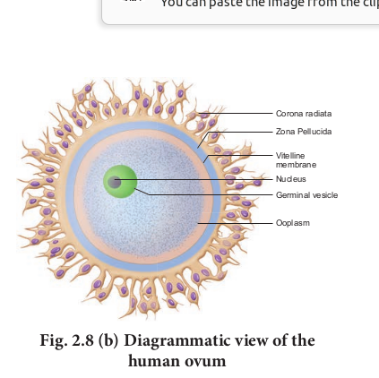
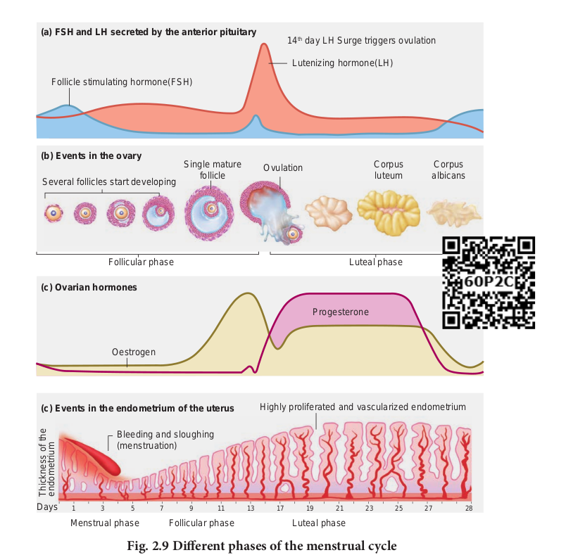

Menstrual cycle


The **menstrual or ovarian cycle** occurs
approximately once in every 28/29 days during the reproductive life of the female from **menarche** (puberty) to **menopause** except during pregnancy. The cycle of events starting from one menstrual period till the next one is called the menstrual cycle during which cyclic changes occurs in the endometrium every month. Cyclic menstruation is an indicator of normal reproductive phase **(Fig. 2.9)

**. **Menstrual cycle comprises of the following phases**

1. Menstrual phase 
2. Follicular or proliferative phase 
3. Ovulatory phase 
4. Luteal or secretory phase

### Menstrual phase 

The cycle starts with the menstrual phase when menstrual flow occurs and lasts for 3-5 days. Menstrual flow is due to the breakdown of endometrial lining of the uterus, and its blood vessels due to decline in the level of progesterone and oestrogen. Menstruation occurs only if the released ovum is not fertilized. Absence of menstruation may be an indicator of pregnancy. However it could also be due to stress, hormonal disorder and anaemia. 




### Follicular or proliferative phase

The follicular phase extends from the 5th
day of the cycle until the time of ovulation. During this phase, the primary follicle in the ovary grows to become a fully mature Graafian follicle and simultaneously, the endometrium regenerates through proliferation. These changes in the ovary and the uterus are induced by the secretion of gonadotropins like FSH and LH, which increase gradually during the follicular phase. It stimulates follicular development and secretion of **oestrogen** by the follicle cells.

### Ovulatory phase

Both LH and FSH attain peak level in the middle of the cycle (about the 14th day). Maximum secretion of LH during the mid cycle called **LH surge** induces the rupture of the Graafian follicle and the release of the ovum (secondary oocyte) from the ovary wall into the peritoneal cavity. This process is called as **ovulation**.

### Luteal or secretory phase

During luteal phase, the remaining part of the Graafian follicle is transformed into a transitory endocrine gland called corpus luteum. The corpus luteum secretes large amount of progesterone which is essential for the maintenance of the endometrium. If Fertilization takes place, it paves way for Menstrual phase Follicular phase the implantation of the fertilized ovum. The uterine wall secretes nutritious fluid in the uterus for the foetus. So, this phase is also called as **secretory phase.** During pregnancy all events of menstrual cycle stop and there is no menstruation. 

In the absence of Fertilization, the corpus luteum degenerates completely and leaves a scar tissue called **corpus albicans**. It also initiates the disintegration of the endometrium leading to menstruation, marking the next cycle.



```
**POLY CYSTIC OVARY SYNDROME (PCOS)** PCOS is a complex endocrine system diso
years. Polycystic means ‘many cysts’. It refers to which contain an egg each. But they do not g fertilized. Women with PCOS may experience ir levels, excessive facial or body hair growth (**hi** increased risk of diabetes. Treatment for PCOS targeted hormone therapy.
```
