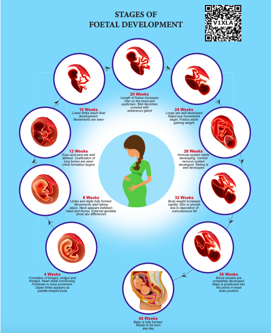

Parturition and lactation

Parturition is the completion of pregnancy and giving birth to the baby. The series of events that expels the infant from the uterus is collectively called “labour”. Throughout pregnancy the uterus undergoes periodic episodes of weak and strong contractions. These contractions called Braxton-Hick’s **contractions** lead to false labour. As the pregnancy progresses, increase in the oestrogen concentration promotes uterine contractions. These uterine contractions facilitate moulding of the foetus and downward movement of the foetus. The descent of the foetus causes dilation of cervix of the uterus and vaginal canal resulting in a neurohumoral reflex called **Foetal ejection reflex or Ferguson reflex. This** initiates the secretion of oxytocin from the neurohypophysis which in turn brings about the powerful contraction of the uterine muscles and leads to the expulsion of the baby through the birth canal. This sequence of events is called as **parturition** or **childbirth**.

Relaxin is a hormone secreted by the placenta and also found in the corpus luteum. It promotes parturition by relaxing the pelvic joints and by dilatation of the cervix with continued powerful contractions. The amnion ruptures and the amniotic fluid flows out through the vagina, followed by the foetus. The placenta along with the remains of the umbilical cord called “after birth” is expelled out after delivery.




```
**CAESAREAN** When normal vaginal delivery the baby and nature of the placenta, the baby i woman’s abdomen and uterus. It is also termed a ‘C’ Section.  
```

**Lactation** is the production of milk by mammary glands. The mammary glands show changes during every menstrual cycle, during pregnancy and lactation. Increased level of oestrogens, progesterone and **human Placental Lactogen (hPL)** towards the end of pregnancy stimulate the hypothalamus towards prolactin – releasing factors. The anterior pituitary responds by secreting **prolactin** which plays a major role in lactogenesis.

Oxytocin causes the **“Let-Down”** reflex- the actual ejection of milk from the alveoli of the mammary glands. During lactation, oxytocin also stimulates the recently emptied uterus to contract, helping it to return to pre - pregnancy size.

```
**Colostrum**

Colostrum, a nutrient rich fluid produced by the human female immediately after giving birth, is loaded with immune, growth and tissue repair factors. It acts as a natural antimicrobial agent to actively stimulate the maturation of the infant’s immune system. No artificial feed can substitute the first milk, with all its natural benefits and therefore should be definitely fed to the baby after birth.
```

The mammary glands secrete a yellowish fluid called **colostrum** during the initial few days after parturition. It has less lactose than milk and almost no fat, but it contains more proteins, vitamin A and minerals.

Colostrum is also rich in **IgA** antibodies. This helps to protect the infant’s digestive tract against bacterial infection. Breast milk is the ideal food for infants as it contains all the constituents in suitable concentration and is easily digestible. It is fully sufficient till about 6 months of age and all infants must be breast fed by the mother to ensure the growth of a healthy baby.

**Summary** 

Reproduction is a process which helps in the continuity and maintenance of a species. Human beings are sexually reproducing and viviparous. The reproductive events include gametogenesis, insemination, Fertilization, cleavage, implantation, placentation, gastrulation, organogenesis and parturition.

The female reproductive system consists of a pair of ovaries, a pair of oviducts, uterus, cervix, vagina and external genitalia. The male reproductive system consists of a pair of testes, a pair of duct system, accessory glands and external genitalia called penis.

The process of formation of gametes in the male is called spermatogenesis and in the female is called oogenesis. The reproductive cycle in females is called menstrual cycle and it is initiated at puberty. The ovum released during the menstrual cycle is fertilized by the sperm and the zygote is formed.

Zygote undergoes repeated mitotic division
and the blastocyst is implanted on the walls of
the uterus. It takes about 280 days or 40 weeks
for the entire development of the human foetus
and it is delivered out through the process of
child birth or parturition. The new born baby is
breast fed by the mother.


```
**World Breast feeding week (WBW) August 1st week**

WBW is organized and promoted world wide by WABA (World Alliance for Breast feeding Action), WHO (World Health Organization) and UNICEF (United Nations International Children's Emergency Fund) to stress the importance of breast feeding during the first six months of baby’s life and a supplemented breast feeding for two years in order to encourage new mothers for the healthy growth and development of their children, to guard them from lethal health problems and diseases including neonatal jaundice, pneumonia, cholera, etc., The Government of Tamil Nadu has also initiated various projects like Mother’s Milk Bank, Feeding rooms in bus terminals and also organisizes awareness campaigns during the first week of August to highlight the importance of breast feeding to infants.
```

**INTERESTING FACTS**

1. Males are said to be sterile when they fail to produce viable sperms.
2. Azoospermia refers to the failure of spermatogenesis.
3. Enlargement of prostate gland is called prostatitis and can lead to difficulty in urination.
4. Castration or surgical removal of testis is known as orchidectomy
5. Spermarche is the first ejaculation of the semen.

```
**Arunachalam Muruganantham**
(Inventor And Social Entrepreneur)

Arunachalam Muruganantham is the man behind the world’s first low cost sanitary napkin making machine. His mission was to provide sanitary napkins at minimal cost to poor women across the country, especially in rural areas. The journey began when he was shocked by the fact that women in India including his wife often used things such as old rags, leaves and even ash during menstruation. Approximately 70 percent of all reproductive diseases in India are caused by poor menstrual hygiene. 23 percent of girls drop out of schools once they attain puberty. He wished to make a social impact by creating more livelihoods and improving the menstrual hygiene of rural women. 

Arunachalam initiated his research in 1999 and almost after 5 years, successfully created a low cost machine for the production of sanitary napkins. He presented his prototype to IIT, Madras for a national innovation competition in 2006 and out of 943 entries, his machine stood first. Arunachalam made 250 machines in 18 months and set out to states in Northern India namely Bihar, Madhya Pradesh, Rajasthan and Uttar Pradesh. 

Arunachalam Muruganantham was named one of the Time Magazine’s 100 most influential people in 2014. He was awarded the Padma Shri in 2016.
```
