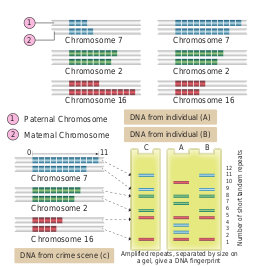

DNA fingerprinting technique

The DNA fingerprinting technique was first developed by Alec Jeffreys in 1985 (Recipient of the Royal Society’s Copley Medal in 2014). Each of us have the same chemical structure of DNA. But there are millions of differences in the DNA sequence of base pairs. This makes the uniqueness among us so that each of us except identical twins is different from each other genetically. The DNA of a person and finger prints are unique. There are 23 pairs of human chromosomes with 1.5 million pairs of genes. It is a well known fact that genes are segments of DNA which differ in the sequence of their nucleotides. Not all segments of DNA code for proteins, some DNA segments have a regulatory function, while others are intervening sequences (introns) and still others are repeated DNA sequences. In DNA fingerprinting, short repetitive nucleotide sequences are specific for a person. These nucleotide sequences are called as **variable number tandem repeats (VNTR)**.The VNTRs of two persons generally show variations and are useful as genetic markers.

DNA finger printing involves identifying differences in some specific regions in DNA sequence called **repetitive DNA**, because in these sequences, a small stretch of DNA is repeated many times. These repetitive DNA are separated from bulk genomic DNA as different peaks during density gradient centrifugation. The bulk DNA forms a major peak and the other small peaks are referred to as **satellite DNA**. Depending on base composition (A : T rich or G : C rich), length of segment and number of repetitive units, the satellite DNA is classified into many sub categories such as micro-satellites, mini- satellites, etc., These sequences do not code for any proteins, but they form a large portion of human genome. These sequences show high degree of polymorphism and form the basis of DNA fingerprinting (Fig. 5.15). DNA isolated

Fig. 5.15 Schematic representation of DNA fingerprinting : Few representative chromosomes
have been shown to contain different copy number of VNTR

from blood, hair, skin cells, or other genetic evidences left at the scene of a crime can be compared through VNTR patterns, with the DNA of a criminal suspect to determine guilt or innocence. VNTR patterns are also useful in establishing the identity of a homicide victim, either from DNA found as evidence or from the body itself.

**The Steps in DNA Fingerprinting technique is as follows:** 1\. **Extraction of DNA**

The process of DNA fingerprinting starts with obtaining a sample of DNA from blood, semen, vaginal fluids, hair roots, teeth, bones, etc.,

2\. **Polymerase chain reaction (PCR)** In many situations, there is only a small amount of DNA available for DNA fingerprinting. If needed many copies of the DNA can be produced by PCR (DNA amplification).

3\. **Fragmenting DNA**

DNA is treated with restriction enzymes which cut the DNA into smaller fragments at specific sites.

4\. **Separation of DNA by electrophoresis** During electrophoresis in an agarose gel, the DNA fragments are separated into bands of different sizes. The bands of separated DNA are sieved out of the gel using a nylon membrane (treated with chemicals that allow for it to break the hydrogen bonds of DNA so there are single strands).

5\. **Denaturing DNA** The DNA on gels is denatured by using alkaline chemicals or by heating.

6\. **Blotting** The DNA band pattern in the gel is transferred to a thin nylon membrane placed over the ‘size fractionated DNA strand’ by **Southern blotting**.

7\. Using probes to identify specific DNA A radioactive probe (DNA labeled with a radioactive substance) is added to the DNA bands. The probe attaches by base
pairing to those restriction fragments that are complementary to its sequence. The probes can also be prepared by using either ‘fluorescent substance’ or ‘radioactive isotopes’.

8\. **Hybridization with probe**

After the probe hybridizes and the excess probe washed off, a photographic film is placed on the membrane containing ‘DNA hybrids’.

9\. Exposure on film to make a genetic/DNA **Fingerprint**

The radioactive label exposes the film to form an image (image of bands) corresponding to specific DNA bands. The thick and thin dark bands form a pattern of **bars** which constitutes a genetic fingerprint.

### Application of DNA finger printing

• **Forensic analysis** \- It can be used in the

identification of a person involved in criminal activities, for settling paternity or maternity disputes, and in determining relationships for immigration purposes.

• **Pedigree analysis** – inheritance pattern of genes through generations and for detecting inherited diseases.

• **Conservation of wild life** – protection of endangered species. By maintaining DNA records for identification of tissues of the dead endangered organisms.

• **Anthropological studies**–It is useful in determining the origin and migration of human populations and genetic diversities.

**Summary** In the twentieth century, one of the landmark

discovery in biology was the identification of DNA, as genetic material of living organisms. Gene may be defined as a segment of DNA which is responsible for inheritance and expression of a particular character.

In 1953, James Watson and Francis Crick proposed DNA structure based on X-ray crystallographic studies provided by Maurice  

Wilkins and Rosalind Franklin. Nucleotides are the structural units of nucleic acids. Each nucleotide has three components, i) pentose sugar ii) nitrogenous base and iii) phosphate. DNA and RNA are polynucleotides. DNA has double stranded helical structure while RNA is a single stranded structure. DNA acts as genetic material of almost all the living organism except few viruses.

The non genetic RNAs are of three types; m-RNA, r-RNA and t-RNA. They help in protein synthesis. DNA has capacity of replication, while the three types of RNA are transcribed on DNA. Meselson and Stahl (1958) proved experimentally the semi-conservative nature of DNA replication using heavy isotope of nitrogen N15 in _E.coli_.

In 1958 Crick proposed that DNA determines the sequence of amino acids in a polypeptide (protein) through mRNA, and proposed the central dogma of protein synthesis which involves transcription and translation. The process of copying genetic information from one strand of DNA into RNA is termed transcription. The DNA transcribed RNA molecules serve as a template for the synthesis of polypeptides by a process termed translation. Each amino acid in a polypeptide chain is represented by a sequence of three nucleotides in the RNA known as the genetic code. RNA transfers genetic message from nucleus to the cytoplasm. DNA is always present in the nucleus and synthesis is also confined to the nucleus

Jacob and Monod proposed the classical model of _Lac_ operon to explain gene expression and regulation in _E. coli_. In _lac_ operon a polycistronic structural gene is regulated by a common promoter and regulator. It is an example of negative control of transcription initiation.

Human genome project, a mega project was aimed to sequence every gene in the human genome. Polymerase chain reaction is an _in vitro_ method of synthesis of nucleic acids wherein, a specific DNA segment is amplified rapidly without concomitant replication of the rest of the DNA molecule. DNA fingerprinting is a technique to identify variations in individuals of a population at the DNA level. It has immense applications in the field of forensic analysis, pedigree analysis, anthropological studies, and conservation of wild life.

