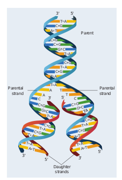
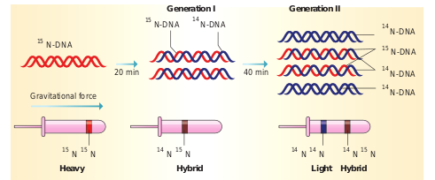
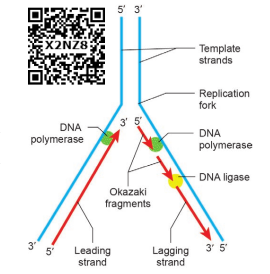

DNA Replication

Replication of DNA takes place during the S phase of cell cycle. During replication, each DNA molecule gives rise to two DNA strands, identical to each other as well as to the parent strand. Three hypotheses of DNA replication have been proposed. They are conservative replication, dispersive replication, and semi- conservative replication.

In conservative replication, the original double helix serves as a template. The original molecule is preserved intact and an entirely new double stranded molecule is synthesized. In dispersive replication, the original molecule is broken into fragments and each fragment

**Fig. 5.4 Semiconservative DNA replication** serves as a template for the synthesis of complementary fragments. Finally two new molecules are formed which consist of both old and new fragments.

**Fig. 5.5 Meselson and Stahl experiment to suppo**  

Semi-conservative replication was proposed by Watson and Crick in 1953. This mechanism of replication is based on the DNA model. They suggested that the two polynucleotide strands of DNA molecule unwind and start separating at one end. During this process, covalent hydrogen bonds are broken. The separated single strand then acts as template for the synthesis of a new strand. Subsequently, each daughter double helix carries one polynucleotide strand from the parent molecule that acts as a template and the other strand is newly synthesised and complementary to the parent strand **(Fig. 5.4)**.

### Experimental proof of DNA replication

The mode of DNA replication was determined in 1958 by Meselson and Stahl. They designed an experiment to distinguish between semi conservative, conservative and dispersive replications. In their experiment, they grew two cultures of _E.coli_ for many generations in separate media. The ‘heavy’ culture was grown in a medium in which the nitrogen source (NH4Cl) contained the heavy isotope 15N and the ‘light’ culture was grown in a medium in which the nitrogen
source contained light isotope 14N for many generations. At the end of growth, they observed that the bacterial DNA in the heavy culture contained only 15N and in the light culture only 14N. The heavy DNA could be distinguished from light DNA (15N from 14N) with a technique called **Cesium Chloride (CsCl) density gradient centrifugation**. In this process, heavy and light DNA extracted from cells in the two cultures settled into two distinct and separate bands (hybrid DNA) (**Fig. 5.5**).

The heavy culture (15N) was then transferred into a medium that had only NH4Cl, and took samples at various definite time intervals (20 minutes duration). After the first replication, they extracted DNA and subjected it to density gradient centrifugation. The DNA settled into a band that was intermediate in position between the previously determined heavy and light bands. After the second replication (40 minutes duration), they again extracted DNA samples, and this time found the DNA settling into two bands, one at the light band position and one at intermediate position. These results confirm Watson and Crick’s semi conservative replication hypothesis.

### Enzymes and mechanism of replication

In prokaryotes, replication process requires three types of DNA polymerases (DNA polymerase I, II, and III). DNA polymerase III is the main enzyme involved in DNA replication. DNA polymerase I (also known as **Kornberg enzyme**) and DNA polymerase II are involved in DNA repair mechanism. Eukaryotes have five types of DNA polymerases that catalyses the polymerization of nucleotides at the 3' OH of the new strand within a short period of time. _E.coli_ that has 4.6 X 106 bp completes its replication process within 38 minutes. Replication takes place faster at the same time accurately. Any error will lead to mutation. However replication errors are corrected by repair enzymes such as nucleases. Deoxy nucleoside triphosphate acts as substrate and also provides energy for polymerization reaction. Replication begins at the initiation site called the site of ‘**origin of replication’ (ori)**. In prokaryotes, there is only one origin of replication, whereas in eukaryotes with giant DNA molecules, there can be several origins of replication (replicons). Since the two strands of DNA cannot be separated throughout at a time (due to large requirement of energy) the replication occurs within a small opening of the DNA helix called as replication fork. Unwinding of the DNA strand is carried out by DNA helicase. Thus, in one strand (template strand with polarity 3' 5') the replication is continuous and is known as the **leading strand** while in the other strand (coding strand with polarity 5' 3') replication is discontinuous, known as the lagging strand (Fig. 5.6). The discontinuously synthesized fragments of the lagging strand (called the **Okazaki fragments**) are joined by the enzyme DNA ligase.

**Fig 5.6 Mechanism of replication showing a replication fork**

As they move away in both directions, newly synthesized complementary nucleotides are paired with the existing nucleotides on the parent strand and covalently bonded together by **DNA polymerase**. Formation of new strand requires a primer (a short stretch of RNA)for initiation. The primer produces a 3'-OH end on the sequence of ribonucleotides, to which deoxy ribonucleotides are added. The RNA primer is ultimately removed leaving a gap in the newly synthesized DNA strand. It is removed from 5' end one by one by the exonuclease activity of DNA polymerase. Finally, when all the nucleotides are in position, gaps are sealed by the enzyme **DNA ligase**.

At the point of origin of replication, the helicases and topoisomerases (DNA gyrase) unwind and pull apart the strands, forming a Y-Shaped structure called the **replication fork**. There are two replication forks at each origin. The two strands of a DNA helix have an antiparallel orientation. The enzyme DNA polymerase can only catalyse the addition of a nucleotide to the new strands in the 5' 3' direction, as it can only add nucleotides to the 3' carbon position.
