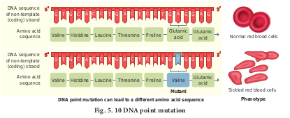
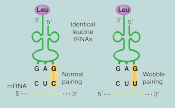

Genetic Code

DNA is the genetic material that carries genetic information in a cell and from generation to generation. At this stage, an attempt will be made to determine in what manner the genetic information exists in DNA molecule? Are they written in coded language on a DNA molecule? If they occur in the language of codes what is the nature of genetic code? The translation of proteins follows the triplet rule; a sequence of three mRNA base (a codon) designates one of the 20 different kinds of amino acids used in protein synthesis.

Genetic code is the sequence relationship between nucleotide in genes (or mRNA) and the amino acids in the proteins they encode. There are 64 possible triplets, and 61 of them are used to represent amino acids. The remaining three triplet codons are termination signals for polypeptide chains. Since there are only 20 amino acids involved in protein synthesis, most of them are encoded by more than one triplet. Two things make this multiple (degenerate) coding possible. First, there is more than one tRNA for most amino acids. Each tRNA has a different anticodon. Second, this pairing is highly specific for the first two portions on the codon, permitting Watson and Crick base pairs (A – U and G - C) to be formed. But at the third position there is a great deal of flexibility as to which base pairs are acceptable. Most part of the genetic code is universal, being the same in prokaryotes and eukaryotes.

The order of base pairs along DNA molecule controls the kind and order of amino acids found in the proteins of an organism. This specific order of base pairs is called genetic code, the blue print establishing the kinds of proteins to be synthesized which makes an organism unique.

**Marshall Nirenberg**, **Severo Ochoa** (enzyme polynucleotide phosphorylase called Ochoa’s enzyme), **Hargobind Khorana**, **Francis Crick** and many others have contributed significantly to decipher the genetic code. The order in which bases are arranged in mRNA decides the order in which amino acids are arranged in proteins. Finally a checker board for genetic code was prepared (**table 5.1**).

The salient features of genetic code are as follows:

• The genetic codon is a **triplet code** and 61 codons code for amino acids and 3 codons do not code for any amino acid and function as **stop codon (**Termination**)**.

• The genetic code is universal. It means that all known living systems use nucleic acids and the same three base codons (triplet codon) direct the synthesis of protein from amino acids. For example, the mRNA (UUU) codon codes for phenylalanine in all cells of all organisms. Some exceptions are reported in prokaryotic, mitochondrial and  

chloroplast genomes. However similarities are more common than differences.

• A non-overlapping codon means that the same letter is not used for two different codons. For instance, the nucleotide sequence GUU GUC represents only two codons.

• It is comma less, which means that the message would be read directly from one end to the other i.e., no punctuation are needed between two codes.

• A degenerate code means that more than one triplet codon could code for a specific amino acid. For example, codons GUU, GUC, GUA and GUG code for valine.

• Non-ambiguous code means that one codon will code for one amino acid.

• The code is always read in a fixed direction i.e. from 5'→3' direction called polarity.

• AUG has dual functions. It acts as a initiator codon and also codes for the amino acid methionine.

**Table 5.1 Genetic code dictionary**

| UUU   Phe   F   PhenylalanineUUC   Phe   F   PhenylalanineUUA   Leu   L   LeucineUUG   Leu   L   Leucine |UCU   Ser   S   SerineUCC   Ser   S   SerineUCA   Ser   S   SerineUCG   Ser   S   Serine |UAU   Tyr   Y   TyrosineUAC   Tyr   Y   TyrosineUAA             TerminationUAG             Termination |UGU   Cys   C   CysteineUGC   Cys   C   CysteineUGA             TerminationUGG   Trp   W   Tryptophan |
|------|------|------|------|
| CUU   Leu   L   LeucineCUC   Leu   L   LeucineCUA   Leu   L   LeucineCUG   Leu   L   Leucine |CCU   Pro   P   ProlineCCC   Pro   P   ProlineCCA   Pro   P   ProlineCCG   Pro   P   Proline |CAU   His   H   HistidineCAC   His   H   HistidineCAA   Gln   Q   GlutamineCAG   Gln   Q   Glutamine |CGU   Arg   R   ArginineCGC   Arg   R   ArginineCGA Arg   R   ArginineCGG   Arg   R   Arginine |
| AUU   Ile   I   IsoleucineAUC   Ile   I   IsoleucineAUA   Ile   I   IsoleucineAUG   Met   M   Methionine |ACU   Thr   T   ThreonineACC   Thr   T   ThreonineACA   Thr   T   ThreonineACG   Thr   T   Threonine |AAU   Asn   N   AsparagineAAC   Asn   N   AsparagineAAA   Lys   K   LysineAAG   Lys   K   Lysine |AGU   Ser   S   SerineAGC   Ser   S   SerineAGA Arg   R   ArginineAGG   Arg   R   Arginine |
  

• UAA, UAG and UGA) codons are designated as termination (stop) codons and also are known as “non-sense” codons.

### Mutation and genetic code

Comparative studies of mutations (sudden change in a gene) and corresponding alteration in amino acid sequence of specific protein have confirmed the validity of the genetic code. The relationship between genes and DNA are best understood by mutation studies. The simplest type of mutation at the molecular level is a change in nucleotide that substitutes one base for another. Such changes are known as base substitutions which may occur spontaneously or due to the action of mutagens. A well studied example is sickle cell anaemia in humans which results from a point mutation of an allele of β-haemoglobin gene (βHb). A haemoglobin molecule consists of four polypeptide chains of two types, two α chains and two β-chains. Each chain has a heme group on its surface. The heme groups are involved in the binding of oxygen. The human blood disease, sickle cell anaemia is due to abnormal haemoglobin. This abnormality in haemoglobin is due to a single base substitution at the sixth codon of the beta globin gene from GAG to GTG in β -chain of haemoglobin. It results in a change of amino acid glutamic acid to valine at the 6th position of the β -chain. This is the classical

---
**Wobble Hypothesis** 
It is a hypothesis proposed by Crick

(1966) which states that tRNA anticodon has the ability to wobble at its 5’ end by pairing with even non-complementary base of mRNA codon. According to this hypothesis, in codon-anticodon pairing the third base may not be complementary. The third base of the codon is called wobble base and this position is called wobble position. The actual base pairing occurs at first two positions only. The importance of Wobbling hypothesis is that it reduces the number of tRNAs required for polypeptide synthesis and it overcomes the effect of code degeneracy.

In the above example though the codon and the anti codon do not match perfectly, yet the required amino acid is brought perfectly. This enables the economy of tRNA, GUU, GUC, GUA and GUG code for the amino acid - Valine.

---

example of point mutation that results in the change of amino acid residue glutamic acid to valine (**Fig. 5.10**). The mutant haemoglobin undergoes polymerisation under oxygen tension causing the change in the shape of the RBC from biconcave to a sickle shaped structure.

The effect of point mutation can be understood by the following example.

**ABC DEF GHI JKL**

If we insert a letter **O** between **DEF** and **GHI** the arrangement would be

**ABC DEF OGH IJK L**

If we insert **OQ** at the same place the arrangement would be

**ABC DEF OQG HIJ KL**

The above information shows that insertion or deletion of one or two bases, changes the reading frame from the point of insertions or deletions. Such mutations are referred to as frame shift insertion or deletion mutations. This forms the genetic basis of proof that codon is a triplet and is read in a continuous manner.
