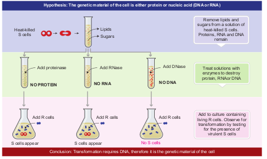
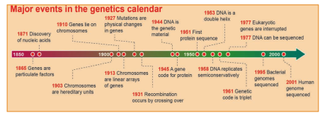
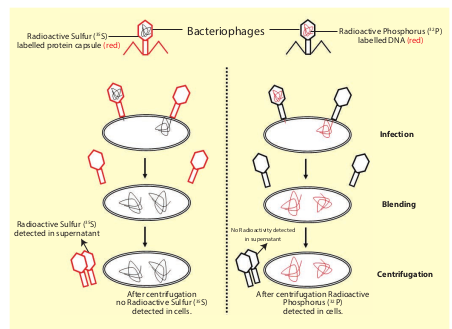

In search of the genetic material

As early as 1848, Wilhelm Hofmeister, a German botanist, had observed that cell nuclei organize themselves into small, rod like bodies during mitosis called **chromosomes**. In 1869, Friedrich Miescher, a Swiss physician, isolated a substance from the cell nuclei and called it as **nuclein**. It was renamed as nucleic acid by Altman (1889), and is now known as DNA. By 1920, it became clear that chromosomes are made up of proteins and DNA. Many experiments were carried out to study the actual carriers of genetic information. Griffith's experiment proved that DNA is the genetic material which has been dealt in class XI. Bacterial transformation experiments provided the first proof that DNA is the genetic material. However, he could not understand the cause of bacterial transformation, and the biochemical nature of genetic material was not defined from his experiments.

Later, Oswald Avery, Colin Macleod and Maclyn McCarty in 1944 repeated Griffith’s experiments in an ‘_in vitro_’ system in order to identify the nature of the transforming substance responsible for converting a non- virulent strain into virulent strain. They observed that the DNA, RNA and proteins isolated from the heat-killed S-strain when added to R-strain changed their surface character from rough to smooth and also made them pathogenic **(Fig. 5.1)**. But when the extract was treated with **DNase** (an enzyme which destroys DNA) the transforming ability was lost. **RNase** (an enzyme which destroys RNA) and

**Fig. 5.1 Transformation expe**  

**proteases** (an enzyme which destroys protein) did not affect the transformation. Digestion with DNase inhibited transformation suggesting that the DNA caused the transformation. These experiments suggested that DNA and not proteins is the genetic material. The phenomenon, by which DNA isolated from one type of cell (S – strain), when introduced into another type (R-strain), is able to retain some of the properties of the S - strain is referred to as **transformation**.

**riment of Avery _et. al.,_ (1944)**

  
