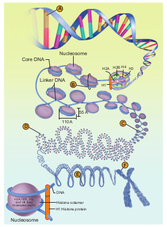

Packaging of DNA helix

The distance between two consecutive base pairs is 0.34nm (0.34×10-9m) of the DNA double helix in a typical mammalian cell. When the total number of base pairs is multiplied with the distance between two consecutive base pairs (6.6 × 109 × 0.34 ×10-9m/bp), the length of DNA double helix is approximately 2.2 m. (The total length of the

**Condensation of DNA - A - DNA, B-Nucleosomes nes, C- Chromatin fiber, D- Coiled chromatin r, E- Coiled coil, F- metaphase chromatid**

double helical DNA = total number of base pairs × distance between two consecutive base pairs). If the length of _E. coli_ DNA is 1.36 mm, the number of base pairs in _E. coli_ is 4 ×106bp (1.36 × 103 m/0.34 ×10-9). The length of the DNA double helix is far greater than the dimension of a typical mammalian nucleus (approximately 10-6 m). How is such a long DNA polymer packaged in a cell?

Chromosomes are carriers of genes which are responsible for various characters from generation to generation. Du Praw (1965) proposed a single stranded model (unineme), as a long coiled molecule which is associated with histone proteins in eukaryotes. Plants and animals have more DNA than bacteria and must fold this DNA to fit into the cell nucleus. In prokaryotes such as _E. coli_ though they do not have defined nucleus, the DNA is not scattered throughout the cell. DNA (being negatively charged) is held with some proteins (that have positive charges) in a region called the nucleoid. The DNA as a nucleoid is organized into large loops held by protein. DNA of prokaryotes is almost circular and lacks chromatin organization, hence termed **genophore**.

In eukaryotes, this organization is much more complex. Chromatin is formed by a series of repeating units called **nucleosomes**. Kornberg proposed a model for the nucleosome, in which 2 molecules of the four histone proteins H2A, H2B, H3 and H4 are organized to form a unit of eight molecules called **histone octamere. The negatively charged DNA** is wrapped around the positively charged histone octamere to form a structure called **nucleosome**. A typical nucleosome contains 200 bp of DNA helix. The histone octameres are in close contact and DNA is coiled on the outside of nucleosome. Neighbouring nucleosomes are connected by linker DNA (H1) that is exposed to enzymes. The DNA makes two complete turns around the histone octameres and the two turns are sealed off by an H1 molecule. Chromatin lacking H1 has a **beads-on-a-string** appearance in which DNA enters and leaves the nucleosomes at random places. H1 of one nucleosome can interact with H1 of the neighbouring nucleosomes resulting in the further folding of the fibre. The chromatin fiber in interphase nuclei and mitotic chromosomes have a diameter that vary between 200-300 nm and represents inactive chromatin. 30 nm fibre arises from the folding of nucleosome, chains into a **solenoid** structure having six nucleosomes per turn. This structure is stabilized by interaction between different H1 molecules. DNA is a solenoid and packed about 40 folds. The hierarchical nature of chromosome structure is illustrated in **(Fig. 5.3)**. Additional set of proteins are required for packing of chromatin at higher level and are referred to as non-histone chromosomal proteins (NHC). In a typical nucleus, some regions of chromatin are loosely packed (lightly stained) and are referred to as euchromatin. The chromatin that is tightly packed (stained darkly) is called heterochromatin. Euchromatin is transcriptionally active and heterochromatin is transcriptionally inactive.
