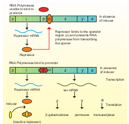

Regulation of gene expression

We have previously established how DNA is organized into genes, how genes store genetic information, and how this information is expressed. We now consider the most fundamental issues in molecular genetics. How is genetic expression regulated? Evidence in support of the idea that genes can be turned on and off is very convincing. Regulation of gene expression has been extensively studied in prokaryotes, especially in _E. coli_. Gene expression can be controlled or regulated at transcriptional or post transcriptional or translational level. Here, we are going to discuss regulation of gene expression at transcriptional level. Usually, small extracellular or intracellular metabolites trigger initiation or inhibition of gene expression. The clusters of gene with related functions are called operons. They usually transcribe single mRNA molecules. In _E.coli_, nearly 260 genes are grouped into 75 different operons.

Many antibiotics do not allow pathogenic bacteria to flourish in animal host because they inhibit one or the other stage of bacterial protein synthesis. The antibiotic tetracycline inhibits binding between aminoacyl tRNA and mRNA. Neomycin inhibits the interaction between tRNA and mRNA. Erythromycin inhibits the translocation of mRNA along the ribosome. Streptomycin inhibits the initiation of translation and causes misreading. Chloramphenicol inhibits peptidyl transferase and formation of peptide bonds.

**Structure of the operon**: Each operon is a unit of gene expression and regulation and consists of one or more **structural genes** and an adjacent operator gene that controls transcriptional activity of the structural gene. 
i) The structural gene codes for proteins,rRNA and tRNA required by the cell. 
ii) Promoters are the signal sequences in DNA that initiate RNA synthesis. RNA polymerase binds to the promoter prior to the initiation of transcription.
iii) The operators are present between the promoters and structural genes. The repressor protein binds to the operator region of the operon.

**The Lac (Lactose) operon: The** metabolism of lactose in _E.coli_ requires three enzymes – permease, β-galactosidase (β-gal) and transacetylase. The enzyme permease is needed for entry of lactose into the cell, β-galactosidase brings about hydrolysis of lactose to glucose and galactose, while transacetylase transfers acetyl group from acetyl Co A to β-galactosidase.

The _lac operon_ consists of one regulator gene (‘i’ gene refers to inhibitor) promoter sites (p), and operator site (o). Besides these, it has three structural genes namely _lac_ z,y and _lac_ a. The _lac_ ‘**z**’ gene codes for β-galactosidase, _lac_ ‘**y**’ gene codes for permease and ‘**a**’ gene codes for transacetylase.

**Jacob** and **Monod** proposed the classical model of _Lac_ operon to explain gene expression and regulation in _E.coli_. In _lac_ operon, a polycistronic structural gene is regulated by a common promoter and regulatory gene. When the cell is using its normal energy source as glucose, the ‘i’ gene transcribes a repressor mRNA and after its translation, a **repressor protein** is produced. It binds to the operator region of the operon and prevents transcription, as a result, β-galactosidase is not produced. In the absence of glucose, if lactose is available as an energy source for the bacteria then lactose enters the cell as a result of permease enzyme. Lactose acts as an inducer and interacts with the repressor to inactivate it.

The repressor protein binds to the operator of the operon and prevents RNA polymerase from transcribing the operon. In the presence of inducer, such as lactose or allolactose, the repressor is inactivated by interaction with the inducer. This allows RNA polymerase to bind to the promotor  

Fig. 5.14 Lac Operon model
site and transcribe the operon to produce _lac_ mRNA which enables formation of all the required enzymes needed for lactose metabolism (**Fig. 5.14**). This regulation of lac operon by the repressor is an example of negative control of transcription initiation. _Lac_ operon is also under the control of positive regulation as well.
