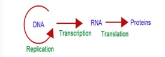

Transcription

Francis Crick proposed the **Central dogma** of protein synthesis in molecular biology states that genetic information flows as follows:

The process of copying genetic information from one strand of DNA into RNA is termed **transcription**. This process takes place in presence of DNA dependent RNA polymerase. In some retroviruses that contain RNA as the genetic material (e.g, HIV), the flow of information is reversed. RNA synthesizes DNA by reverse transcription, then transcribed into mRNA by transcription and then into proteins by translation.

For a cell to operate, its genes must be expressed. This means that the gene products, whether proteins or RNA molecules must be made. The RNA that carries genetic information encoding a protein from genes into the cell is known as messenger RNA (mRNA). For a gene to be transcribed, the DNA which is a double helix must be pulled apart temporarily, and RNA is synthesized by RNA polymerase. This enzyme binds to DNA at the start of a gene and opens the double helix. Finally, RNA molecule is synthesized. The nucleotide sequence in the RNA is complementary to the DNA template strand from which it is synthesized.

Both the strands of DNA are not copied during transcription for two reasons. 1. If both the strands act as a template, they would code for RNA with different sequences. This in turn would code for proteins with different amino acid sequences. This would result in one segment of DNA coding for two different proteins, hence complicate the genetic information transfer machinery. 2. If two RNA molecules were produced simultaneously, double stranded RNA complementary to each other would be formed. This would prevent RNA from being translated into proteins.

### Transcription unit and gene 

A transcriptional unit in DNA is defined by three regions, a **promoter**, the **structural gene** and a terminator. The promoter is located towards the 5' end of the coding strand. It is a DNA sequence that provides binding site for RNA polymerase. The presence of promoter in a transcription unit, defines the template and coding strands. The terminator region located towards the 3' end of the coding strand contains a DNA sequence that causes the RNA polymerase to stop transcribing. In eukaryotes the promoter has AT rich regions called **TATA box** (**Goldberg-Hogness box**) and in

  **Fig. 5. 7 Schematic structure of a transcription unit**

prokaryotes this region is called **Pribnow box**. Besides promoter, eukaryotes also require an enhancer.

The two strands of the DNA in the structural gene of a transcription unit have opposite polarity. DNA dependent RNA polymerase catalyses the polymerization in only one direction, the strand that has the polarity 3' 5' acts as a template, and is called the **template strand. The other strand which has** the polarity 5' 3' has a sequence same as RNA (except thymine instead of uracil) and is displaced during transcription. This strand is called **coding strand** (**Fig. 5.7**).

The structural gene may be monocistronic (eukaryotes) or **polycistronic** (prokaryotes). In eukaryotes, each gene transcribes a single mRNA and encodes information for only a single protein and is called monocistronic mRNA. In prokaryotes, clusters of related genes, known as operon, often found next to each other on the chromosome are transcribed together to give a single mRNA and hence are polycistronic.

Before starting transcription, RNA polymerase binds to the promoter, a recognition sequence in front of the gene. Bacterial (prokaryotic) RNA polymerase consists of the core enzyme and the sigma subunit. The core enzyme (2α, β, β1 and ω) is responsible for RNA synthesis whereas a sigma subunit is responsible for recognition of the promoter. Promoter sequences vary in different organisms. RNA polymerase opens up the DNA to form the transcription bubble. The core enzyme moves ahead, manufacturing RNA leaving the sigma subunit behind at the promoter region. The end of a gene is marked by a terminator sequence that forms a hair pin structure in the RNA. The sub-class of terminators require a recognition protein, known as rho (ρ), to function.

### Process of transcription 

In prokaryotes, there are three major types of RNAs: mRNA, tRNA, and rRNA. All three RNAs are needed to synthesize a protein in a cell. The mRNA provides the template, tRNA brings amino acids and reads the genetic code, and rRNAs play structural and catalytic role during translation. There is a single DNA-dependent RNA polymerase that catalyses transcription of all types of RNA. It binds to the promoter and initiates transcription (Initiation). The polymerases binding sites are called promoters. It uses nucleoside triphosphate as substrate and energy source and polymerases in a template depended fashion following the rule of complementarity. After the initiation of transcription, the polymerase continues to elongate the RNA, adding one nucleotide after another to the growing RNA chain. Only a short stretch of RNA remains bound to the enzyme, when the polymerase reaches a terminator at the end of a gene, the nascent RNA falls off, so also the RNA polymerase.

The question is, how the RNA polymerases are able to catalyse the three steps initiation,elongation and termination? The RNA polymerase is only capable of catalyzing the process of elongation. The RNA polymerase associates transiently with initiation factor sigma (σ) and termination factor rho (r) to initiate and terminate the transcription, respectively. Association of RNA with these factors instructs the RNA polymerase either to initiate or terminate the process of transcription (**Fig. 5.8**).

In bacteria, since the mRNA does not require any processing to become active and also since transcription and translation take place simultaneously in the same compartment (since there is no separation of cytosol and nucleus in bacteria), many times the translation can begin much before the mRNA is fully transcribed. This is because the genetic material is not separated from other cell organelles by a nuclear membrane consequently; transcription and translation can be coupled in bacteria.

In Eukaryotes, there are at least three RNA polymerases in the nucleus (in addition to RNA polymerase found in the organelles). There is a clear division of labour. The RNA polymerase I transcribes rRNAs (28S, 18S and 5.8S), whereas the RNA polymerase III is responsible for transcription of tRNA, 5S rRNA and snRNA. The RNA polymerase II transcribes precursor of mRNA, the

hnRNA (heterogenous nuclear RNA). In eukaryotes, the monocistronic structural genes have interrupted coding sequences known as **exons** (expressed sequences) and non- coding sequences called **introns** (intervening sequences). The introns are removed by a process called **splicing**. hnRNA undergoes additional processing called **capping** and **tailing**. In capping an unusual nucleotide, methyl guanosine triphosphate is added at the 5' end, whereas adenylate residues (200-300) (Poly A) are added at the 3' end in tailing (Fig. 5.9). Thereafter, this processed hnRNA, now called mRNA is transported out of the nucleus for translation.

The split gene feature of eukaryotic genes is almost entirely absent in prokaryotes. Originally each exon may have coded for a single polypeptide chain with a specific function. Since exon arrangement and intron removal are flexible, the exon coding for these polypeptide subunits act as domains combining in various ways to form new genes. Single genes can produce different functional

proteins by arranging their exons in several different ways through alternate splicing patterns, a mechanism known to play an important role in generating both protein and functional diversity in animals. Introns would have arosen before or after the evolution of eukaryotic gene. If introns arose late how did they enter eukaryotic gene? Introns are mobile DNA sequences that can splice themselves out of, as well as into, specific ‘target sites’ acting like mobile transposon-like elements (that mediate transfer of genes between organisms – Horizontal Gene Transfer - HGT). HGT occurs between lineages of prokaryotic cells, or from prokaryotic to eukaryotic cells and between eukaryotic cells. HGT is now hypothesized to have played a major role in the evolution of life on earth.
