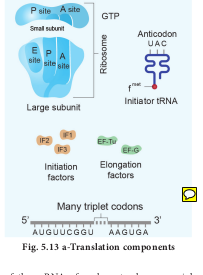
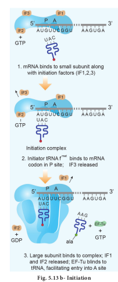
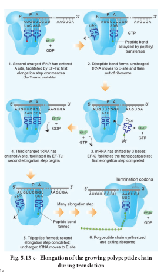
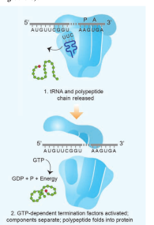

Translation

Translation refers to the process of polymerization of amino acids to form poly peptide chain. The decoding process is carried out by ribosomes that bind mRNA and charged tRNA molecules. The mRNA is translated, starting at the 5' end. After binding to mRNA, the ribosomes move along it, adding new amino acids to the growing polypeptide chain each time it reads a codon. Each codon is read by an anticodon on the corresponding tRNA. Hence the order and sequence of amino acids are defined by the sequence of bases in the mRNA.

### Mechanism of Translation

The cellular factory responsible for synthesizing protein is the ribosome. The ribosome consists of structural RNAs and about 80 different proteins. In inactive state, it exists as two subunits; large subunit and small subunit. When the subunit encounters an mRNA, the process of translation of the mRNA to protein begins. The prokaryotic ribosome (70 S) consists of two subunits, the larger subunit (50 S) and smaller subunit (30 S). The ribosomes of eukaryotes (80 S) are larger, consisting of 60 S and 40 S sub units. ‘S’ denotes the sedimentation coefficient which is expressed as Svedberg unit (S).

One of the alternative ways of dividing up a sequence of bases in DNA or RNA into codons is called **reading frame**. Any sequence of DNA or RNA, beginning with a start codon and which can be translated into a protein is known as an **Open Reading Frame (ORF)**. A translational unit in mRNA is the sequence of RNA that is flanked by the start codon (AUG) and the stop codon and codes for polypeptides. mRNA also have some additional sequences that are not translated and are referred to as **Untranslated Regions (UTR).** UTRs are present at both 5' end (before start codon) and at 3' end (after stop codon). The start codon **(AUG)** begins the coding sequence and is read by a special tRNA that carries methionine (met). The initiator tRNA charged with methionine binds to the AUG start codon. In prokaryotes, N - formyl methionine (f met) is attached to the initiator tRNA whereas in eukaryotes unmodified methionine is used. The 5' end

of the mRNA of prokaryotes has a special sequence which precedes the initial AUG start codon of mRNA. This ribosome binding site is called the **Shine – Dalgarno sequence** or **S-D sequence**. This sequences base-pairs with a region of the 16Sr RNA of the small ribosomal subunit facilitating initiation. The subunits of the ribosomes (30 S and 50 S) are usually dissociated from each other when not involved in translation **(Fig. 5.13a)**.

**Initiation** of translation in _E. coli_ begins with the formation of an initiation complex, consisting of the 30S subunits of the ribosome, a messenger RNA and the charged N-formyl methionine tRNA (fmet – t RNA fmet), three proteinaceous initiation factors (IF1, IF2, IF3), GTP(Guanine Tri Phosphate) and Mg 2+.

The components that form the initiation complex interact in a series of steps. IF3 binds to the 30S and allows the 30S subunit to bind to mRNA. Another initiation protein (IF2) then enhances the binding of charged formyl methionine tRNA to the small subunit

**Fig. 5.13 a-Translation components**  

in response to the AUG triplet. This step ‘sets’ the reading frame so that all subsequent groups of three ribonucleotides are translated accurately.

The assembly of ribosomal subunits, mRNA and tRNA represent the initiation complex. Once **initiation complex** has been assembled, IF3 is released and allows the

**Fig. 5.13 b- Initiation**

initiation complex to combine with the 50S ribosomal subunit to form the complete ribosome (70S). In this process a molecule of GTP is hydrolyzed providing the required energy and the initiation factors (IF1 and IF2 and GDP) are released (**Fig. 5.13 b**).

**Elongation** is the next phase of translation. Once both subunits of the ribosomes are assembled with the mRNA, binding sites for two charged tRNA molecules are formed. The sites in the ribosome are referred to as the aminoacyl site (A site), the peptidyl site (P site) and the exit site (E site). The charged initiator tRNA binds to the P site. The next step in prokaryotic translation is to position the second tRNA at the ‘A’ site of the ribosome to form hydrogen bonds between its anticodon and the second codon on the mRNA (step1). This step requires the correct transfer RNA, another GTP and two proteins called elongation factors (EF-Ts and EF-Tu).

Once the charged tRNA molecule is positioned at the A site, the enzyme peptidyl transferase catalyses the formation of peptide bonds that link the two amino acids together (step 2). At the same time, the covalent bond between the amino acid and tRNA occupying the P site is hydrolyzed (broken). The product of this reaction is a dipeptide which is attached to the 3' end of tRNA still residing in the A site. For elongation to be repeated, the tRNA attached to the P site, which is now uncharged is released

from the large subunit. The uncharged tRNA moves through the ‘**E’ site** on the ribosome.

The entire mRNA-tRNA-aa1-aa2 complex shifts in the direction of the ‘P’ site by a distance of three nucleotides (step 3). This step requires several elongation factors (EFs) and the energy derived from hydrolysis of GTP. This results in the third triplet of mRNA to accept another charged tRNA into the A site (step 4). The sequence of elongation is repeated over and over (step 5 and
step 6). An additional amino acid is added to the growing polypeptide, each time mRNA advances through the ribosome. Once a polypeptide chain is assembled, it emerges out from the base of the large subunit (**Fig. 5.13 c**).

**Termination is the final phase of translation.** Termination of protein synthesis occurs when one of the three stop codons appears in the ‘A’ site of the ribosome. The terminal codon signals the action of **GTP – dependent release factor,** which cleaves the polypeptide chain from the terminal tRNA releasing it from the translational complex (step 1). The tRNA is then released from the ribosome, which then dissociates into its subunits (step 2) (**Fig. 5.13 d**).

**Fig. 5.13 d- Termination of the process of translation**
