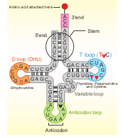
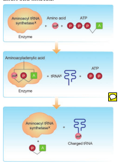

tRNA – the adapter molecule

The transfer RNA, (tRNA) molecule of a cell acts as a vehicle that picks up the amino acids scattered through the cytoplasm and also reads specific codes of mRNA molecules. Hence it is called an **adapter molecule.** This term was postulated by Francis Crick.

The two dimensional clover leaf model of tRNA was proposed by Robert Holley. The secondary structure of tRNA depicted in **Fig. 5.11** looks like a **clover leaf**. In actual structure, the tRNA is a compact molecule which looks like an **inverted L**. The clover leaf model of tRNA shows the presence of three arms namely DHU arm, middle arm and TΨC arm. These arms have loops such as amino acyl binding loop, anticodon loop and ribosomal binding loop at their ends. In addition it also shows a small lump called variable loop or extra arm. The amino acid is attached to one end (amino acid acceptor end) and the other end consists of three anticodon nucleotides. The anticodon pairs with a codon in mRNA ensuring that the correct amino acid is incorporated into the growing polypeptide chain. Four different regions of double-stranded RNA are formed during the folding process. Modified bases are especially common in tRNA. Wobbling between anticodon and codon allows some tRNA molecules to read more than one codon. The process of addition of amino acid to tRNA is known as **aminoacylation** or **charging** and the resultant product is called aminoacyl- tRNA (charged tRNA). Without aminoacylation tRNA is known as uncharged tRNA **(Fig. 5.12).** If two such tRNAs are brought together peptide bond formation is favoured energetically. Numbers of amino acids are joined by peptide bonds to form a polypeptide chain. This aminoacylation is

**Fig. 5.11 Holley’s two-dimensional clover leaf model of transfer RNA**

catalyzed by an enzyme **aminoacyl – tRNA synthetase. This is an endothermic reaction** and is associated with ATP hydrolysis. 20 different aminoacyl – tRNA synthetases are known. The power to recognize codon on the mRNA lies in the tRNA and not in the attached amino acid molecule.

**Fig. 5.12 Steps involved in charging tRNA. The ‘X’ denotes that for each amino acid only the corresponding specific tRNA and specific aminoacyl tRNA synthetase enzyme are involved in the charging process.**

