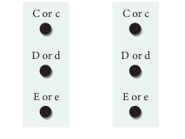

Genetic control of Rh factor

### Fisher and Race hypothesis

Rh factor involves three different pairs of alleles located on three different closely linked loci on the chromosome pair. This system is more commonly in use today, and uses the 'Cde' nomenclature.

In the above **Fig. 4.1**, three pairs of Rh alleles (Cc, Dd and Ee) occur at 3 different loci on homologous chromosome pair. The possible genotypes will be one C or c, one D or d, one E or e from each chromosome. For e.g. CDE/ cde; CdE/cDe; cde/cde; CDe/CdE etc., All genotypes carrying a dominant ‘D’ allele will produce Rh positive phenotype and double recessive genotype ‘dd’ will give rise to Rh
negative phenotype.

### Wiener Hypothesis

Wiener proposed the existence of eight alleles (R1, R2, R0, Rz, r, r1, r11, ry) at a single Rh locus. All genotypes carrying a dominant ‘R allele’ (R1, R2 ,R0 ,Rz) will produce Rh positive phenotype and double recessive genotypes (rr, r1r1, r11r11, ryry) will give rise to Rh negative phenotype.

### Incompatibility of Rh Factor – Erythroblastosis foetalis

Rh incompatability has great significance in child birth. If a woman is Rh negative and the man is Rh positive, the foetus may be Rh positive having inherited the factor from its father. The Rh negative mother becomes sensitized by carrying Rh positive foetus within her body. Due to damage of blood vessels, during child birth, the mother’s immune system recognizes the Rh antigens and gets sensitized. The sensitized mother produces Rh antibodies. The antibodies are IgG type which are small and can cross placenta and enter the foetal circulation. By the time the mother gets sensitized and produce anti ‘D’ antibodies, the child is delivered.

Usually no effects are associated with exposure of the mother to Rh positive antigen during the first child birth, subsequent Rh positive children carried by the same mother, may be exposed to antibodies produced by the mother against Rh antigen, which are carried across the placenta into the foetal blood circulation. This causes haemolysis of foetal RBCs resulting in haemolytic jaundice and anaemia. This condition is known as **Erythoblastosis foetalis or Haemolytic disease of the new born (HDN).**

### Prevention of Erythroblastosis foetalis 

If the mother is Rh negative and foetus is Rh positive, anti D antibodies should be administered to the mother at 28th and 34th week of gestation as a prophylactic measure. If the Rh negative mother delivers Rh positive child then anti D antibodies should be administered to the mother soon after delivery. This develops passive immunity and prevents the formation of anti D antibodies in the mothers blood by destroying the Rh foetal RBC before the mother’s immune system is sensitized. This has to be done whenever the woman attains pregnancy.
