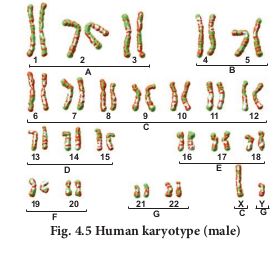

Karyotyping

Karyotyping is a technique through which a complete set of chromosomes is separated from a cell and the chromosomes are arranged in pairs. An idiogram refers to a diagrammatic representation of chromosomes. 

### Preparation of Karyotype

Tjio and Levan (1960) described a simple method of culturing lymphocytes from the human blood. Mitosis is induced followed by addition of colchicine to arrest cell division at metaphase stage and the suitable spread of metaphase chromosomes is photographed. The individual chromosomes are cut from the photograph and are arranged in an orderly fashion in homologous pairs. This arrangement is called a **karyotype**. Chromosome banding permits structural definitions and differentiation of chromosomes. 

### Applications of Karyotyping

- It helps in gender identification. - It is used to detect the chromosomal

aberrations like deletion, duplication, translocation, nondisjunction of chromosomes.

- It helps to identify the abnormalities of chromosomes like aneuploidy.

- It is also used in predicting the evolutionary relationships between species.

- Genetic diseases in human beings can be detected by this technique.

### Human Karyotype

Depending upon the position of the centromere and relative length of two arms, human chromosomes are of three types: Metacentric, sub metacentric and acrocentric. The photograph of chromosomes are arranged in the order of descending length in groups from A to G **(Fig. 4.5). 
