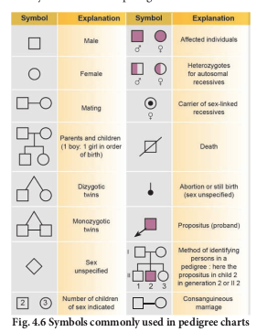

Pedigree Analysis

Pedigree is a “family tree”, drawn with standard genetic symbols, showing the inheritance pathway for specific phenotypic characters.**(Fig. 4.6).** Pedigree analysis is the study of traits as they have appeared in a given family line for several past generations.

### Genetic Disorders 

A genetic disorder is a disease or syndrome that is caused by an abnormality in an individual DNA. Abnormalities can range from a small mutation in a single gene to the addition or subtraction of an entire chromosome or even a set of chromosomes. Genetic disorders are of two types namely, Mendelian disorders and chromosomal disorders.

