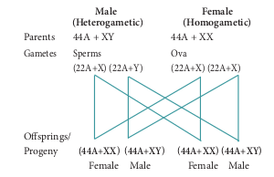
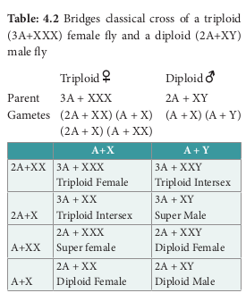
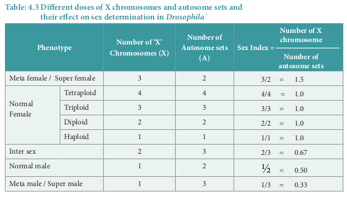

Sex Determination

Sex determination is the method by which the distinction between male and female is established in a species. Sex chromosomes determine the sex of the individual in dioecious or unisexual  
organisms. The chromosomes other than the sex chromosomes of an individual are called autosomes. Sex chromosomes may be similar (homomorphic) in one sex and dissimilar (heteromorphic) in the other. Individuals having homomorphic sex chromosomes produce only one type of gametes (homogametic) whereas heteromorphic individuals produce two types of gametes (heterogametic).

### Chromosomal basis of sex determination Heterogametic Sex Determination:

In heterogametic sex determination one of the sexes produces similar gametes and the other sex produces dissimilar gametes. The sex of the offspring is determined at the time of fertilization.

### Heterogametic Males 

In this method of sex determination the males are heterogametic producing dissimilar gametes while females are homogametic producing similar gametes. It is of two kinds XX-XO type (e.g. Bugs, cockroaches and grasshoppers) and XX-XY type (e.g. Human beings and _Drosophila)_.

### Heterogametic Females

 In this method of sex determination the
females are heterogametic producing dissimilar gametes while males are homogametic producing similar gametes. To avoid confusion with the XX-XO and XX-XY types of sex determination, the alphabets ‘Z’ and ‘W’ are used here instead of X and Y respectively. Heterogametic females are of two types, ZO-ZZ type (eg. Moths, butterflies and domestic chickens) and ZW-ZZ type (eg. Gypsy moth, fishes, reptiles and birds).

### Sex determination in human beings 

Genes determining sex in human beings are
located on two sex chromosomes, called allosomes. In mammals, sex determination is associated with chromosomal differences between the two sexes, typically XX females and XY males. 23 pairs of human chromosomes include 22 pairs of autosomes (44A) and one pair of sex chromosomes (XX or XY). Females are homogametic producing only one type of gamete (egg), each containing one X chromosome while the males are heterogametic producing two types of sperms with X and Y chromosomes. An independently evolved XX: XY system of sex chromosomes also exist in _Drosophila_ **(Fig. 4.2)**.

### The Y Chromosome and Male Development

Current analysis of Y chromosomes has revealed numerous genes and regions with potential genetic function; some genes with or without homologous counterparts are seen on the X. Present at both ends of the Y chromosome are the pseudoautosomal regions (PARs) that are similar with regions on the X chromosome which synapse and recombine during meiosis. The remaining 95% of the
Y chromosome is referred as the Non -
combining Region of the Y (NRY). The NRY
is divided equally into functional genes
(euchromatic) and non functional genes
(heterochromatic). Within the euchromatin
regions, is a gene called Sex determining
region Y (SRY). In humans, absence of
Y chromosome inevitably leads to female
development and this SRY gene is absent in
X chromosome. The gene product of SRY is the
testes determining factor (TDF) present in the
adult male testis.

### Genic balance in Drosophila

 Genic balance mechanisms of sex determination in _Drosophila_ was first studied by C.B. Bridges. In _Drosophila_, the presence of Y chromosome is essential for the fertility of male sex, but does not determine the male sex. The gene for femaleness is located on the X chromosome and those for maleness are located on the autosomes. When geneticist C.B. Bridges, working with _Drosophila_, crossed a triploid (3n) female with a normal male, he observed many combinations of autosomes and sex chromosomes in the offspring. From his results Bridges in 1921 suggested that sex in _Drosophila_ is determined by the balance between the genes for femaleness located on the X chromosomes and those for maleness located on the autosomes. Hence the sex of an individual is determined by the ratio of its X chromosome to that of its autosome sets. This ratio is termed **sex index** and is expressed as:

 Sex Index = \\(\frac{Number of X Chromosomes}{Number of sets of Autosomes}\\)\\(\frac{X}{A}\\)

Change in this ratio leads to a changed sex phenotype. The results obtained from a cross between triploid female _Drosophila_ (3A:3X) with a diploid male (2A: XY) is shown in **tables 4.2. and 4.3.**

- X-Chromosome was discovered by
Henking (1891)

- Y-Chromosome was discovered by
Stevens (1902)

When the X **:** A ratio is 1.00 as in a normal female, or greater than 1.00, the organism is a female. When this ratio is 0.50 as in a normal male or less than 0.50 the organism is a male. At 0.67, the organism is an intersex. metamales

(X/A = 0.33) and metafemales (X/A=1.50) are usually very weak and sterile.

A sex–switch gene in _Drosophila_ directs female development. This gene, sex–lethal (SxL) located on the X chromosome, has two states of activity. When it is ‘on’ it directs female development and when it is ‘off ’ maleness ensures. Other genes located on the X chromosome and autosomes regulate this sex-switch gene. However, the Y- chromosome of _Drosophila_ is required for male fertility.

### Gynandromorphs

These individuals have parts of their body expressing male characters and other parts of the body expressing female characters. The organism is made up of tissues of male and female genotype and represents a mosaic pattern.

### Dosage compensation - Barr body

In 1949, Barr and Bertram first observed a condensed body in the nerve cells of female cat which was absent in the male. This condensed body was called sex chromatin by them and was later referred as **Barr body**. In the XY chromosomal system of sex determination, males have only one X chromosome, whereas females have two. A question arises: how
does the organism compensate for this dosage differences between the sexes? In mammals the necessary dosage compensation is accomplished by the inactivation of one of the X chromosome in females so that both males and females have only one functional X chromosome per cell.

Mary Lyon suggested that Barr bodies represented an inactive chromosome, which in females becomes tightly coiled into a heterochromatin, a condensed and visible form of chromatin (Lyon’s hypothesis). The number of Barr bodies observed in cell was one less than the number of X-Chromosome. XO females have no Barr body, whereas XXY males have one Barr body.

- The number of Barr bodies follows N-1 rule (N minus one rule), where N is the total number of X chromosomes present.

### Haplodiploidy in Honeybees 

In hymenopteran insects such as honeybees, ants and wasps a mechanism of sex determination called haplodiploidy mechanism of sex determination is common. In this system, the sex of the offspring is determined by the number of sets of chromosomes it receives. Fertilized eggs develop into females (Queen or Worker) and unfertilized eggs develop into males (drones) by parthenogenesis. It means that the males have half the number of chromosomes (haploid) and the females have double the number (diploid), hence the name haplodiplody for this system of sex determination.

This mode of sex determination facilitates the evolution of sociality in which only one diploid female becomes a queen and lays the eggs for the colony. All other females which are diploid having developed from fertilized eggs help to raise the queen’s eggs and so contribute to the queen’s reproductive success and indirectly to their own, a phenomenon known as Kin Selection. The queen constructs their social environment by releasing a hormone that suppresses fertility of the workers.  
