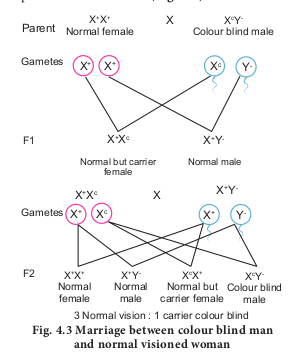
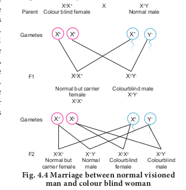

Sex Linked Inheritance

The inheritance of a trait that is determined by a gene located on one of the sex chromosomes is called sex linked inheritance. Genes present on the differential region of X or Y chromosomes are called sex linked genes. The genes present in the differential region of X chromosome are called X linked genes. The X–linked genes have no corresponding alleles in the Y chromosome. The genes present in the differential region of Y chromosome are called Y- linked or **holandric genes. The Y linked genes have no** corresponding allele in X chromosome. The Y linked genes inherit along with Y chromosome and they phenotypically express only in the male sex. Sex linked inherited traits are more common in males than females because, males are hemizygous and therefore express the trait when they inherit one mutant allele. The X – linked and Y – linked genes in the differential region (non–homologus region) do not undergo pairing or crossing over during meiosis. The inheritance of X or Y linked genes is called sex-linked inheritance.

### Inheritance of X - linked genes 
Red-green colour blindness or daltonism, haemophilia and Duchenne’s muscular dystrophy are examples of X-linked gene inheritance in humans.

**1.Haemophilia** 

Haemophilia is commonly known as bleeder’s disease, which is more common in men than women. This hereditary disease was first reported by John Cotto in 1803. Haemophilia is caused by a recessive X-linked gene. A person with a recessive gene for haemophilia lacks a normal clotting substance (thromboplastin) in blood, hence minor injuries cause continuous bleeding, leading to death. The females are carriers of the disease and would transmit the disease to 50% of their sons even if the male parent is normal. Haemophilia follows the characteristic criss - cross pattern of inheritance.

**2. Colour blindness** 

In human beings a dominant X – linked gene is necessary for the formation of colour sensitive cells, the cones. The recessive form of this gene is incapable of producing colour sensitive cone cells. Homozygous recessive females (XcXc) and hemizygous recessive males (XcY) are unable to distinguish red and green colour. The inheritance of colour blindness can be studied in the following two types of marriages.

(i) **Marriage between colour blind man and normal visioned woman**

A marriage between a colour blind man and a normal visioned woman will produce normal visioned male and female individuals in F1 generation but the females are **carriers**. The marriage between a F1 normal visioned carrier woman and a normal visioned male will produce one normal visioned female, one carrier female, one normal visioned male and one colour blind male in F2 generation. Colour blind trait is inherited from the male parent to his grandson through carrier daughter, which is an example of criss-cross pattern of inheritance **(Fig. 4.3).**

**ii) Marriage between normal visioned man and colour blind woman**

If a colour blind woman (XcXc) marries a normal visioned male (X+Y), all F1 sons will be colourblind and daughters will be normal visioned but are carriers.

Marriage between F1 carrier female with a **colour blind** male will produce normal visioned carrier daughter, colourblind daughter, normal visioned son and a colourblind son in the F2 generation **(Fig. 4.4).**

### Inheritance of Y- linked genes 

Genes in the non-homologous region of the Y-chromosome are inherited directly from male to male. In humans, the Y-linked or holandric genes for hypertrichosis (excessive development of hairs on pinna of the ear) are transmitted directly from father to son, because males inherit the Y chromosome from the father. Female inherits only X chromosome from the father and are not affected.
