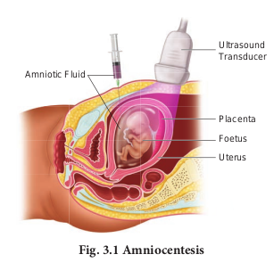
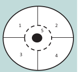

Detection of foetal disorders during early pregnancy

### Ultrasound scanning

Ultrasound has no known risks other than mild discomfort due to pressure from the transducer on the abdomen or vagina. No radiation is used during this procedure. Ultrasonography is usually performed in the first trimester for dating, determination of the number of foetuses, and for assessment of early pregnancy complications.

```
There are several types of ultrasound imaging techniques. As the most common type, the 2-D ultrasound provides a flat picture of one aspect of the baby. The 3-D image allows the health care provider to see the width, height and depth of the images, which can be helpful during the diagnosis. The latest technology is 4-D ultrasound, which allows the health care provider to visualize the unborn baby moving in real time with a three-dimensional image.
```

### Amniocentesis 

Amniocentesis involves taking a small
sample of the amniotic fluid that surrounds the foetus to diagnose for chromosomal abnormalities (**Fig. 3.1**).



Amniocentesis is generally performed in a pregnant woman between the 15th and 20th weeks of pregnancy by inserting a long, thin needle through the abdomen into the amniotic sac to withdraw a small sample of amniotic fluid. The amniotic fluid contains cells shed from the foetus.

### Chorionic Villus Sampling (CVS)

CVS is a prenatal test that involves taking a sample of the placental tissue to test for chromosomal abnormalities.

### Foetoscope 

Foetoscope is used to monitor the foetal heart rate and other functions during late pregnancy and labour. The average foetal heart rate is between 120 and 160 beats per minute. An abnormal foetal heart rate or pattern may mean that the foetus is not getting enough oxygen and it indicates other problems.

```
BREAST SELF EXAMINATION AND EARLY DIAGNOSIS OF CANCER 

1. Breast is divided into 4 quadrants and the center (Nipple) which is the 5th quadrant.

2. Each quadrant of the breast is felt for lumps using the palm of the opposite hand.

3. The examination is done in both lying down and standing positions, monthly once after the 1st week of menstrual cycle.



This way if there are lumps or any deviation of the nipple to one side or any blood discharge from the nipple we can identify cancer at an early stage. Mammograms are usually done for women above the age of 40 years and for young girls and women below 40 years, ultrasound of the breast aids in early diagnosis of breast cancer.
```

A hand-held doppler device is often used during prenatal visits to count the foetal heart rate. During labour, continuous electronic foetal monitoring is often used.

-  Vitamin E is known as anti-sterility vitamin as it helps in the normal functioning of reproductive structures.

-  Sex hormones were discovered by Adolf Butenandt.

-  11th July is observed as World Population Day.

-  1st December is observed as World AIDS Day.

-  NACO (National AIDS Control Organisation) was established in 1992.

-  Syphilis and gonorrhoea are commonly called as international diseases.

**Summary** 
Reproductive health refers to a total well- being in all aspects of reproduction. Providing medical facilities and care to the problems like menstrual irregularities, pregnancy related aspects, medical termination of pregnancy, STI, birth control, infertility, post natal child and maternal management are the important aspect of the Reproductive and Child Health Care programmes.

An overall improvement in reproductive health has taken place in our country as indicated by reduced maternal and infant mortality rates, assistance to infertile couples, etc. Improved health facilities and better living conditions promote an explosive growth of population. Such a growth necessitated intense propagation of contraceptive methods. Various contraceptive options are available now such as natural, traditional, barrier, IUDs, pills, injectables, implants and surgical methods. Though contraceptives are not regular
requirements for reproductive health, one is adviced to use them to avoid pregnancy or to delay or space pregnancy.

Diseases or infections transmitted through coitus are called Sexually transmitted infections (STIs). Pelvic inflammatory diseases (PIDs), still birth, infertility are some of the complications of STDs. Early detection facilitates better cure of these diseases. Avoiding coitus with unknown/ multiple partners, use of condoms during coitus are some of the simple precautions to avoid contracting STIs. Inability to conceive or produce children even after unprotected sexual cohabitation is called infertility. Various methods are now available to help such couples. -In vitro- fertilization followed by transfer of embryo into the female genital tract is one such method.
