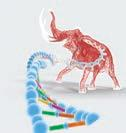

  

**ZOOLOGY**

A publication under Free Textbook Programme of Government of Tamil Nadu

**Department of School Education**

**HIGHER SECONDARY SECOND YEAR**

**Untouchability is Inhuman and a Crime**

**GOVERNMENT OF TAMIL NADU**

XII Std Zoology Introduction EM.indd 1 12/14/2021 10:56:05 AM

  

**CONTENTS**

III

**ZOOLOGY**

**AssessmentE-book**

**UNIT CONTENTS PAGE**

**No. MONTH**

**UNIT I**

Chapter 1 Reproduction in Organisms 01

JuneChapter 2 Human Reproduction 11

Chapter 3 Reproductive Health 32

**UNIT II**

Chapter 4 Principles of Inheritance and Variation 45 July

Chapter 5 Molecular Genetics 61

Chapter 6 Evolution 92 August

**UNIT III**

Chapter 7 Human Health and Diseases 112 August

Chapter 8 Immunology 129

Chapter 9 Microbes in Human Welfare 148 September

**UNIT IV**

Chapter 10 Applications of Biotechnology 157 October

**UNIT V**

Chapter 11 Organisms and Populations 176 October

Chapter 12 Biodiversity and its Conservation 197 November

Chapter 13 Environmental Issues 219

XII Std Zoology Introduction EM.indd 3 12/14/2021 10:56:05 AM

  

Conceptual picture with caption relating to every chapter is given in this text book.

Goals to transform the classroom processes into learner centric with a list of bench marks **Learning Objectives:**

Presents a complete overview of the chapter**Chapter Outline**

Conceptual diagram that depicts relationships between concepts to enable students to learn the content schematically**Concept Map**

Explanation of scientific termsGlossary

Assess students to pause, think and check their understanding**Evaluation**

List of digital resources**Web links**

List of related books for further details of the topic**References**

Superfluous information about a personality or day to day life experience relating to the content

Directions are provided to students to conduct activities in order to explore, enrich the concept.**Activity**

Visual representation of the lesson to enrich learning .**Infographics**

To motivate the students to further explore the content digitally and take them to virtual world

Amazing facts, Rhetorical questions to lead students to biological inquiry

HOW TO USE THE BOOK?

To enhance digital Science skills among students**ICT**

_New life for woolly mammoth DNA-researchers can now re-create the genes of mammoth and study the proteins they encoded_

IV

XII Std Zoology Introduction EM.indd 4 12/14/2021 10:56:06 AM

  

**Institutes affiliated to Dr. M.G.R. Medical University, Chennai.**

**Occupation Therapy Colleges:** • College of Occupational Therapy, Christian Medical College, Vellore

**Physiotherapy Colleges:** • Govt. College of Physiotherapy, Trichy • Govt. Institute of Rehabilitation Medicine, Chennai • College of Physiotherapy, Christian Medical College, Vellore • Tamilnadu Paramedical Institutions College of Physiotherapy, Chennai

**Siddha Colleges:** • Govt. Siddha Medical College, Chennai • Govt. Siddha Medical College, Tirunelveli • National Institute of Siddha, Chennai

Who can participate? : Secondary and Higher Secondary students

**Five stages of Exam Stage I** : National Standard Examination in Biology **Stage II** : Indian National Biology Olympiad **Stage III** : Orientation cum Selection Camp in Biology **Stage IV** : Pre-departure Training Camp for

International Biology Olympiad (IBO) (for 4 members)

**Stage V** : Participation in IBO **Weblink:** https://www.entrancei.com

Ministry of Science and Technology offers biology scholarship to 100 students from schools around the country. Among them 52 (two from each state board) are selected for the award which carries a cash prize of Rs 20,000, a certificate and a medal. http://www.dbtindia.nic.in

It also offers INSPIRE programme for science students. www.online.inspire.gov.in Tamilnadu State Council of Science and Technology offers Young Scientists Fellowship

Scheme to encourage scientist below 40 years, who are working in educational institutions. They are given Rs.10000 for 2- 6 months. (http://www.tanscst.nic.in/)

Tamilnadu State Council of Science and Technology offers Student project scheme for Science and Technology useful to our society. Student scientists are awarded with the cash prize of Rs.5000 - 10000 for their best project or model. (http://www.tanscst.nic.in/)

**Prospects of Zoology**

**National and International Biology Olympiad Exam**

**Scholarship for Biology Students**

**Institutes affilia ed to Dr. M.G.R. Medical University, Chennai.**

V

XII Std Zoology Introduction EM.indd 5 12/14/2021 10:56:06 AM

  

**Pharmacy Colleges:** • Coimbatore Medical College, Coimbatore • College of Pharmacy, Madras Medical

College, Chennai • College of Pharmacy, Madurai Medical

College, Madurai • Thanjavur Medical College, Thanjavur • College of Allied Medical Sciences,

Madurai • Department of Pharmacy, Annamalai

University, Cuddalore

**Nursing Colleges:** • College of Nursing, Madras Medical

College, Chennai • College of Nursing, Madurai Medical

College, Madurai

**Medical Colleges:** • Cancer Institute, College of Oncological

Sciences, Chennai • Chengalpattu Medical College,

Chengalpattu • Christian Medical College, Vellore • Coimbatore Medical College, Coimbatore • Government Dharamapuri Medical

College, Dharampuri • Kanyakumari Govt. Medical College,

Kanyakumari • Kilpauk Medical College, Chennai • Madras Medical College and Research

Institute, Chennai • Madurai Medical College, Madurai • Stanley Medical College, Chennai • Thanjavur Medical College, Thanjavur • Theni Government Medical College,

Theni • Thoothukudi Govt. Medical College,

Thoothukudi • Tirunelveli Medical College, Tirunelveli

• Vellore Govt. Medical College, Vellore

**Homeopathy Colleges:** • Govt. Homeopathic Medical College

and Hospital, Tirumangalam • Tamilnadu Homeopathy Medical

College, Salem

**Dental Colleges:** • Tamilnadu Govt. Dental College,

Chennai

**Ayush Institutions In Tamilnadu** • Ayurveda College, 242-B, Trichy

Road, Sulur, 215 Pathanjalipuri (Post), Coimbatore – 641402

• Venkataramana Ayurveda College, 216 596,A1&A2,31st St. TNHB Colony, Periyar Nagar, Korattur, Chennai

• Sri Sai Ram Ayurvedic Medical College & 217 Research Centre, Saileo Nagar, Poonthandalam Village, Sriperumbudur, Chennai – 600044

• Dharma Ayurvedic Medical College and Hosp, 48 218 Grand West Trunk Road, Sriperumbudur, Kanchipuram, 602 105

• Sri Sankara College of Ayurveda, Sannasipatti, 219 Poolankulathupatti (Post) Trichy-620009

• Tamilnadu Veterinary University, Chennai

• Veterinary College and Research Institute, Namakkal

• Fishery College and Research Institute, Thoothukudi

**Prospects of Zoology**

**List of Tamilnadu Veterinary colleges affiliated to Tamilnadu**

**Veterinary University**

VI

XII Std Zoology Introduction EM.indd 6 12/14/2021 10:56:06 AM

  

• Tamilnadu Agricultural University, Coimbatore

• Agricultural College and Research Institute, Kanniyakumari

• Agricultural Engineering College and Research Institute, Coimbatore

• Avvaiyar Government College for Women, Kodaikanal

• Horticulture College and Research Institute, Periyakulam

**Institutes conducting Researches in Zoology**

**Indian Institute of Science (IISC) Bangalore**

• Biochemistry (BC) • Central Animal Facility (CAF) • Centre for Ecological Sciences (CES) • Centre for Infectious Disease Research

(CIDR) • Centre for Neuroscience (CNS) • Microbiology and Cell Biology (MCB) • Molecular Biophysics Unit (MBU)

**IFS (Indian Forest Service Examination) Examination** • Conducting authority - UPSC • Educational - B.Sc. in any one degree like Physics, Chemistry, Botany, Zoology,

Qualification: Agriculture, Maths, Geology, or B.E or B.V.Sc. • Age - Minimum 21, Maximum 32 Yrs • Weblink - https://upsconline.nic.in

**Salim Ali Centre for Ornithology and Natural History (SACON) Coimbatore** • National Ornithological Databank

(NOD) Cell • GIS Laboratory • Ecotoxicology Laboratory • Conservation Genetics Laboratory

**Institute of Basic Medical Science (IBMS) Tharamani, Chennai** • Blood transfusion • Chromatography • Mass spectroscopy • Clinical Data interpretation • Diagnosis of blood courses

**Centre for Marine Fisheries and Research Institute (CMFRI)** • Marine capture fisheries • Mariculture • Biodiversity • Marine Biotechnology • Fishery environment

**National Environmental Engineering Research Institute (NEERI)** • Air Pollution control • Climate sustainability and skill

development • Cleaner technology and modeling • Environmental Biotechnology and

Genomic division

**Prospects of Zoology**

**List of Tamilnadu Agricultural colleges affiliated to Tamilnadu**

**Agricultural University in Tamilnadu**

**IFS (Indian Forest Service) Examination**

VII

XII Std Zoology Introduction EM.indd 7 12/14/2021 10:56:06 AM

  

**ZOOLOGY HIGHER SECONDARY SECOND YEAR**

VIII

XII Std Zoology Introduction EM.indd 8 12/14/2021 10:56:06 AM

