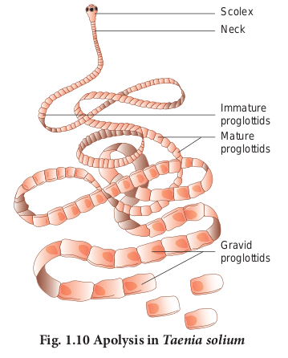

  


**Learning Objectives**

- Learns the modes of asexual reproduction in organisms.

- Understands the significance of asexual reproduction.

- Comprehends the different modes of sexual reproduction.

- Realizes the significance and advantage of sexual reproduction and its role in evolution.

Living organisms show a life cycle involving birth, growth, development,maturation, reproduction and death. Reproduction is the fundamental feature of all living organisms. It is a biological process by which organisms produce their young ones. The young ones grow and mature to repeat the process. Thus reproduction results  in continuation of species and introduces variations in organisms, which are essential for adaptation and evolution of their own kind.

## Modes of reproduction

All modes of reproduction have some basic features such as synthesis of RNA and proteins, replication of DNA, cell division and growth, formation of reproductive units and their fertilization to form new individuals. Organisms exhibit two major modes of reproduction namely asexual and sexual reproduction. Reproduction by a single parent without the involvement of gamete formation is **asexual reproduction** and the offspring produced are genetically identical. Asexual reproduction is usually by amitotic or mitotic division of the somatic (body) cells, hence is also known as somatogenic or blastogenic reproduction. When two parents participate in the reproductive process involving two types of gametes (ova and sperm), it is called **sexual reproduction.**

## Asexual reproduction

Asexual reproduction is wide spreadamong different organisms. It is common in members of Protista, Bacteria, Archaea and_Paramecia is capable of both sexual and asexual reproduction._in multicellular organisms with relatively simpler organisation. The offsprings show “uniparental inheritance” without any genetic variation. The different modes of asexual reproduction seen in animals are fission, budding, fragmentation and regeneration.

**Fission** is the division of the parent body into two or more identical daughter individuals. Five types of fission are seen in animals. They are **binary fission, multiple fission, plasmotomy, strobilation and sporulation.**

In **binary fission**, the parent organism divides into two halves and each half forms a daughter individual. The nucleus divides first amitotically or mitotically (karyokinesis), followed by the division of the cytoplasm (cytokinesis). The resultant offsprings are genetically identical to the parent. Depending on the plane of fission, binary fission is of the following types,

i)Simple irregular binary fission
ii) Transverse binary fission
iii) Longitudinal binary fission
iv) Oblique binary fission


  
**Simple irregular binary fission** is seen in irregular shaped organisms like _Amoeba_ (**Fig. 1.1**), where the plane of division is hard to observe. The contractile vacuoles cease to function and disappear. The nucleoli disintegrate and the nucleus divides mitotically. The cell then constricts in the middle, so the cytoplasm divides and forms two daughter cells.

In **transverse binary fission**, the plane of the division runs along the transverse axis of the individual. e.g. _Paramecium_ and _Planaria_. In _Paramecium_ (**Fig. 1.2**) the macronucleus divides by amitosis and the micronucleus divides by mitosis.

In **longitudinal binary fission**, the nucleus and the cytoplasm divides in the longitudinal axis of the organism (**Fig 1.3**). In flagellates, the flagellum is retained usually by one daughter cell. The basal granule is divided into two and the new basal granule forms a flagellum in the other daughter individual. e.g. _Vorticella_ and _Euglena._

In **oblique binary fission** the plane of division is oblique. It is seen in dinoflagellates. e.g. _Ceratium._

In **multiple fission** the parent body divides into many similar daughter cells simultaneously. First, the nucleus divides repeatedly, later the cytoplasm divides into as many parts as that of nuclei. Each cytoplasmic part encircles one daughter nucleus. This results in the formation of many smaller individuals from a single parent organism. If multiple fission produces four or many daughter individuals by equal cell division and the young ones do not separate until the process is complete, then this division is called **repeated fission.** e.g. _Vorticella_.


  
During unfavorable conditions (increase or decrease in temperature, scarcity of food) _Amoeba_ withdraws its pseudopodia and secretes a three-layered, protective, chitinous cyst wall around it and becomes inactive (**Fig. 1.4**). This phenomenon is called **encystment.** When conditions become favourable, the encysted _Amoeba_ divides by multiple fission and produces many minute amoebae called **pseudopodiospore** or **amoebulae.** The cyst wall absorbs water and breaks off liberating the young pseudopodiospores, each with a fine pseudopodia. They feed and grow rapidly to lead an independent life.

In some metazoan animals, a special type of transverse fission called **strobilation** occurs


(**Fig. 1.5**). In the process of strobilation, several transverse fissions occur simultaneously giving rise to a number of individuals which often do not separate immediately from each other e.g. _Aurelia_. **Plasmotomy** is the division of multinucleated parent into many multinucleate daughter individuals with the division of nuclei. Nuclear division occurs later to maintain normal number of nuclei. Plasmotomy occurs in _Opalina_ and _Pelomyxa (_Giant _Amoeba)._

During unfavourable conditions _Amoeba_ multiplies by **sporulation** without encystment.

Nucleus breaks into several small fragments or chromatin blocks. Each fragment develops a nuclear membrane, becomes surrounded by cytoplasm and develops a spore-case around it (**Fig. 1.6**). When conditions become favourable, the parent body disintegrates and the spores are liberated, each hatching into a young amoeba.


  
In **budding**, the parent body produces one or more buds and each bud grows into a young one. The buds separate from the parent to lead a normal life. In sponges, the buds constrict and detach from the parent body and the bud develops into a new sponge (**Fig. 1.7**).


When buds are formed on the outer surface of the parent body, it is known as **exogenous budding** e.g. _Hydra_. In _Hydra_ when food is plenty, the ectoderm cells increase and form a small elevation on the body surface (**Fig. 1.8**). Ectoderm and endoderm are pushed out to form the bud. The bud contains an interior lumen in continuation with parent’s gastro-vascular cavity. The bud enlarges, develops a mouth and a circle of tentacles at its free end. When fully grown, the bud constricts at the base and finally separates from the parent body and leads an independent life.

In **_Noctiluca_**, hundreds of buds are formed inside the cytoplasm and many remain within the body of the parent. This is called **endogenous budding**. In freshwater sponges and in some marine sponges a regular and peculiar mode of asexual reproduction occurs by internal buds called **gemmules** is seen (**Fig. 1.9**). A completely grown gemmule is a hard ball, consisting of an internal mass of food-laden archaeocytes. During unfavourable conditions, the sponge disintegrates but the gemmule can withstand adverse conditions. When conditions become favourable, the gemmules begin to hatch.


In **fragmentation**, the parent body breaks into fragments (pieces) and each of the fragment has the potential to develop into a new individual. Fragmentation or pedal laceration occurs in many genera of sea anemones. Lobes are constricted off from the pedal disc and each of the lobe grows mesenteries and tentacles to form a new sea anemone.


In the tapeworm, _Taenia solium,_ the gravid (ripe) proglottids are the oldest at the posterior end of the strobila (Fig. 1.10). The gravid proglottids are regularly cut off either singly or in groups from the posterior end by a process called apolysis. This is very significant since it helps in transferring the developed embryos from the primary host (man) to find a secondary host (pig).




Regen eration is regrowth in the injured
region. Regeneration was first studied in Hydra by Abraham Trembley in 1740. Regeneration is of two types, **morphallaxis** and **epimorphosis**. In morphallaxis the whole body grows from a small fragment e.g. _Hydra_ and _Planaria_. When _Hydra_ is accidentally cut into several pieces, each piece can regenerate the lost parts and develop into a whole new individual (**Fig. 1.11**). The parts usually retain their original polarity, with oral ends, by developing tentacles and aboral ends, by producing basal discs. **Epimorphosis** (**Fig. 1.12**) is the replacement of lost body parts. It is of two types, namely **reparative** and **restorative** regeneration. In reparative regeneration, only certain damaged tissue can be regenerated, e.g. human beings whereas in restorative regeneration severed body parts can develop. e.g. star fish, tail of wall lizard.


## Sexual reproduction

Sexual reproduction involves the fusion of male and female gametes to form a diploid  
zygote, which develops into a new organism. It leads to genetic variation. The types of sexual reproduction seen in animals are syngamy (fertilization) and conjugation. In **syngamy,** the fusion of two haploid gametes takes place to produce a diploid zygote. Depending upon the place where the fertilization takes place, it is of two types. In **external fertilization,** the fusion of male and female gametes takes place outside the body of female organisms in the water medium. e.g. sponges, fishes and amphibians. In internal **fertilization,** the fusion of male and female gametes takes place within the body of female organisms. e.g. reptiles, aves and mammals.

```
**POWER OF REGENERATION**

Sponge when macerated and squeezed through fine silk cloth, the cluster of cells pass through, and these can regenerate new sponges. This technique is used for cultivation of sponges.

```

Different kinds of syngamy (fertilization) are prevalent among living organisms.

**a) Autogamy**- The male and female gametes are produced by the same cell or same organism and both the gametes fuse together to form a zygote. e.g. _Actinosphaerium_ and _Paramecium_.

**b) Exogamy**- The male and female gametes are produced by different parents and they fuse to form a zygote. So it is biparental. e.g. Human beings – dioecious or unisexual animal.

c) **Hologamy-** Lower organisms, sometimes the entire mature organisms do not form gametes but they themselves behave as gametes and the fusion of such mature individuals is known as **hologamy** e.g. _Trichonympha._

d) **Paedogamy-** It is the sexual union of young individuals produced immediately after the division of the adult parent cell by mitosis. e.g. _Actinophrys._

**e) Merogamy**- The fusion of small sized and morphologically different gametes (merogametes) takes place. e.g. _Protozoa._

**f) Isogamy**- The fusion of morphological and physiological identical gametes (isogametes) is called **isogamy**. e.g. _Monocystis._

**g) Anisogamy**- The fusion of dissimilar gametes is called **anisogamy** (_Gr. An_\-without; iso-equal; _gam_\-marriage). Anisogamy occurs in higher animals but it is customary to use the term fertilization instead of anisogamy or syngamy. e.g. higher invertebrates and all vertebrates.

**Conjugation** is the temporary union of the two individuals of the same species. During their union both individuals, called the conjugants exchange certain amount of nuclear material (DNA) and then get separated. Conjugation is common among ciliates, e.g. _Paramecium, Vorticella_ and bacteria (Prokaryotes).

**Phases of life cycle:** Organisms have three phases – Juvenile phase, reproductive phase and senescent phase. **Juvenile phase/ vegetative phase** is the period of growth between the birth of the individual upto reproductive maturity. During **reproductive phase/ maturity phase** the organisms reproduce and their offsprings reach maturity period. On the basis of time, breeding animals are of two types: **seasonal breeders** and **continuous breeders**. Seasonal breeders reproduce at particular period of the year such as frogs, lizards, most birds, deers etc., Continuous breeders continue to breed throughout their sexual maturity e.g. honey bees, poultry, rabbit etc., **Senescent phase** begins at the end of reproductive phase when degeneration sets in the structure and functioning of the body.  

**PARTHENOGENESIS (_Gr. Parthenos_ – virgin, _Genesis_\- produce)**

Development of an egg into a complete individual without fertilization is known as parthenogenesis. It was first discovered by Charles Bonnet in 1745. Parthenogenesis is of two main types namely, Natural Parthenogenesis and Artificial Parthenogenesis. In certain animals, parthenogenesis occurs regularly, constantly and naturally in their life cycle and is known as **natural parthenogenesis**.

```
**Natural parthenogenesis are of**

**different types:**

a) Arrhenotoky: In this type only males are produced by parthenogenesis. eg: honey bees b) Thelytoky: In this type only females are produced by parthenogenesis.eg: Solenobia c) Amphitoky: In this type parthenogenetic egg may develop into individuals of any sex. eg: _Aphis_
```

Natural parthenogenesis may be of two types, viz., complete and incomplete. **Complete** **parthenogenesis** is the only form of reproduction in certain animals and there is no biparental sexual reproduction. There are no male organisms and so, such individuals are represented by females only. **Incomplete parthenogenesis** is found in some animals in which both sexual reproduction and parthenogenesis occurs. e.g. In honeybees; fertilized eggs (zygotes) develop into queen and workers, whereas unfertilized eggs develop into drones (male). In **paedogenetic parthenogenesis (paedogenesis)** the larvae produce a new generation of larvae by parthenogenesis. It occurs in the sporocysts and Redia larvae of liver fluke. It is also seen in the larvae of some insects. e.g. Gall fly. In **artificial parthenogenesis**, the unfertilized egg (ovum) is induced to develop into a complete individual by physical or chemical stimuli. e.g., Annelid and seaurchin eggs.

**Summary**

Reproduction is a process by which the living beings propagate or duplicate their own kind. Reproduction can be broadly classified into asexual reproduction and sexual reproduction. In asexual reproduction fusion of gametes are not involved, but in sexual reproduction the formation and fusion of gametes occur. Different modes of asexual reproduction are fission, budding, fragmentation and regeneration. Fission is further divided into binary fission, multiple fission, sporulation and strobilation. According to the plane of fission different kinds of binary fission have been identified in different organisms. They are simple irregular binary fission, transverse binary fission, longitudinal binary fission and oblique binary fission. Multiple fission is the division of the parent into many small daughter cells simultaneously. Budding is another mode of asexual reproduction. The parent body produces one or more buds; each bud grows into a young one and may separate from the parent to lead a normal life. When many buds are formed on the outer surface of the parent, it is known as exogenous budding. Hundreds of buds are formed inside the cytoplasm and remain within the body of the parent, this process is called endogenous budding. Fragmentation is another mode of asexual reproduction. In fragmentation the body of the parent breaks into fragments (pieces). Each fragment has the potential to develop into a new individual. Regeneration is the development of the whole body of an organism from a small fragment. It is of two types namely restorative regeneration and reparative regeneration.

Various modes of sexual reproduction is seen in animals. In syngamy the fusion of two haploid gametes takes place to produce a zygote. The following kinds of syngamy is prevalent among the living organism. They are autogamy, exogamy, hologamy, paedogamy, merogamy, isogamy, anisogamy  
and conjugation. Parthenogenesis is the special type of sexual reproduction seen in animals. It is of two main types namely natural parthenogenesis and artificial parthenogenesis.
