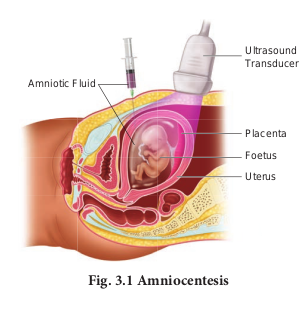
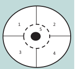

 
**Learning objectives**

-➢ Understands the importance of sex
 education and reproductive health.-

-➢ Learns the importance of amniocentesis as a pre-natal diagnosis.-

-➢ Evaluates the effects of maternal and infant mortality.-

-➢ Identifies, compares and explains different types of contraceptive devices.-

-➢ Discusses the medical necessity and social consequences of MTP.-

-➢ Explains the reasons of transmission and prevention of STDs.-

-➢ Highlights the reasons of infertility. 

-➢ Develops a positive and healthy attitude-towards reproductive life.-

  
Reproductive health represents a society with people having physically and functionally normal reproductive organs. Healthy people have healthier babies and are able to care for their family, and contribute more to the society and community. Hence, health is a community issue. Reproductive system is a complex system controlled by the neuro-endocrine system, hence, it is important to take necessary steps to protect it from infectious diseases and injury.

## 3.1. Need for reproductive health- Problems and strategies

India is amongst the first few countries in the world to initiate the **‘Family planning programme’** since 1951 and is periodically assessed every decade. These programmes are popularly named as ‘**Reproductive and Child Health Care** (RCH). Major tasks carried out under these programmes are:

-  Creating awareness and providing medical assistance to build a healthy society.

-  Introducing sex education in schools to provide information about adolescence and adolescence related changes.

-  Educating couples and those in the marriageable age groups about the available birth control methods and family planning norms.

-  Creating awareness about care for pregnant women, post-natal care of mother and child and the importance of breast feeding.

-  Encouraging and supporting governmental and non-governmental agencies to identify new methods and/or to improve upon the existing methods of birth control.
``` 
Do You Know 

Globally, about 800 women die every day of preventable causes related to pregnancy and childbirth; 20 per cent of these women are from India. Similarly India's infant mortality rate was 44 per 1,000 live. Although, India has witnessed dramatic growth over the last two decades, maternal mortality still remains high as in comparison to many developing nations. **-source:-** -http://unicef.in-  
```

```
Health care programmes such as massive child immunization, supply of nutritional food to the pregnant women, Janani Suraksha Yojana, Janani Shishu Suraksha Karyakaram, RMNCH+A approach (an integrated approach for reproductive, maternal, new born, child and adolescent health), Pradhan Mantri Surakshit Matritva Abhiyan, etc., are taken up at the national level by the Government of India.
```
##3.2. Amniocentesis and its statutory ban

Due to small family norms and the skewed choice for a male child, female population is decreasing at an alarming rate. Amniocentesis is a prenatal technique used to detect any chromosomal abnormalities in the foetus and it is being often misused to determine the sex of the foetus. Once the sex of the foetus is known, there may be a chance of female foeticide. Hence, a statutory ban on amniocentesis is imposed.

## 3.3. Social impact of sex ratio, female foeticide and infanticide

The sex ratio is the ratio of males to the females in a population. In India, the child sex ratio has decreased over the decade from 927 to 919 female for every 1000 males. To correct this ratio, steps are needed to change the mind set and attitudes of people, especially in the young adults. Female foeticide and infanticide is the manifestation of gender discrimination in our society.

**Female foeticide** refers to ‘aborting the female in the mother’s womb’; whereas female **infanticide** is ‘killing the female child after her birth’. These have resulted in imbalance in sex ratio. In **UNDP’s GII** 2018 (United nations developmental programmes gender inequality index) reflected that India was ranked at 135 out of 187 countries due to availability of very few economic opportunities to women as compared to men.

In order to prevent female foeticide and infanticide, Government of India has taken various steps like **PCPNDT Act** (Pre-Conception and Pre-Natal Diagnostic Technique Act-1994) enacted to ban the identification of sex and to prevent the use of prenatal diagnostic techniques for selective abortion. Various measures are taken by the Government to ensure survival, provision of better nutrition, education, protection and empowerment of girls by eliminating the differences in the sex ratio, infant mortality rate and improving their nutritional and educational status. **POCSO Act** (Prevention Of Children from Sexual Offences), **Sexual harassment at workplace** (Prevention, prohibition and redressal) Act and the changes in the Criminal law based
on the recommendations of **Justice Verma Committee**, 2013 aims at creating a safe and secure environment for both females and males.

## 3.4. Population explosion and birth control

Increased health facilities and better living conditions have enhanced longevity. According to a recent report from the UN, India’s population has already reached 1.26 billion and is expected to become the largest country in population size, surpassing China around 2022. To overcome the problem of population explosion, birth control is the only available solution. People should be motivated to have smaller families by using various contraceptive devices. Advertisements by the Government in the media as well as posters/bills, etc., with a slogan -Naam iruvar namakku iruvar- (we two, ours two) and -Naam iruvar namakku oruvar- (we two, ours one) have also motivated to control population growth in Tamilnadu. Statutory rising of marriageable age of the female to 18 years and that of males to 21 years and incentives given to couples with small families are the other measures taken to control population growth in our country. 

### Birth control methods

The voluntary use of contraceptive procedures to prevent fertilization or prevent implantation of a fertilized egg in the uterus is termed as birth control. **An ideal contraceptive should be** user friendly, easily available, with least side effects and should not interfere with sexual drive. The contraceptive methods are of two types – **temporary** and **permanent.** Natural, chemical, mechanical and hormonal barrier methods are the temporary birth control methods.

**1. Natural method** is used to prevent meeting of sperm with ovum. i.e., Rhythm method (safe period), coitus interruptus, continuous abstinence and lactational amenorrhoea.  

**a. Periodic abstinence/rhythm method** Ovulation occurs at about the 14th day of the menstrual cycle. Ovum survives for about two days and sperm remains alive for about 72 hours in the female reproductive tract. Coitus is to be avoided during this time.

**b. Continuous abstinence** is the simplest and most reliable way to avoid pregnancy is not to have coitus for a defined period that facilitates conception. 

**c. Coitus interruptus** is the oldest family planning method. The male partner withdraws his penis before ejaculation, thereby preventing deposition of semen into the vagina.

**d. Lactational amenorrhoea** Menstrual cycles resume as early as 6 to 8 weeks from parturition. However, the reappearance of normal ovarian cycles may be delayed for six months during breast- feeding. This delay in ovarian cycles is called **lactational amenorrhoea.** It serves as a natural, but an unreliable form of birth control. Suckling by the baby during breast-feeding stimulates the pituitary to secrete increased prolactin hormone in order to increase milk production. This high prolactin concentration in the mother’s blood may prevent menstrual cycle by suppressing the release of GnRH (Gonadotropin Releasing Hormone) from hypothalamus and gonadotropin secretion from the pituitary.

**2. Barrier methods** In these methods, the ovum and sperm are prevented from meeting so that fertilization does not occur.

**a.** **Chemical barrier** Foaming tablets, melting suppositories, jellies and creams are used as chemical agents that inactivate the sperms in the vagina.

**b. Mechanical barrier** Condoms are a thin sheath used to cover the penis in male whereas in female it is used to cover vagina and cervix just before coitus so as to prevent the entry of ejaculated semen into the female reproductive tract. This can prevent conception. Condoms should be discarded after a single use. Condom also safeguards the user from AIDS and STDs. Condoms are made of polyurethane, latex and lambskin.

**Diaphragms, cervical caps and vaults** are made of rubber and are inserted into the female reproductive tract to cover the cervix before coitus in order to prevent the sperms from entering the uterus. 

**c. Hormonal barrier** 

It prevents the ovaries from releasing the ova and thickens the cervical fluid which keeps the sperm away from ovum. 

**Oral contraceptives —** 

Pills are used to prevent ovulation by inhibiting the secretion of FSH and LH hormones. A combined pill is the most commonly used birth control pill. It contains synthetic progesterone and estrogen hormones. **Saheli,** contraceptive pill by Central Drug Research Institute (CDRI) in Lucknow, India contains a non-steroidal preparation called **Centchroman**.

**d. Intrauterine Devices** 

(IUDs) Intrauterine devices are inserted by medical experts in the uterus through the vagina. These devices are available as copper releasing IUDs, hormone releasing IUDs and non-medicated IUDs. IUDs increase phagocytosis of sperm within the uterus. IUDs are the ideal contraceptives for females who want to delay pregnancy. It is one of the popular methods of contraception in India and has a success rate of 95 to 99%. **Copper releasing IUDs** differ from each other by the amount of copper. Copper  IUDs such as **Cu T-380 A, Nova T, Cu 7, Cu T 380 Ag, Multiload 375, etc.** release free copper and copper salts into the uterus and suppress sperm motility. They can remain in the uterus for five to ten years. 

**Hormone-releasing IUDs** such as **Progestasert and**  **LNG – 20** are often called as intrauterine systems (IUS). They increase the viscosity of the cervical mucus and thereby prevent sperms from entering the cervix. 

**Non-medicated IUDs** are made of plastic or stainless steel. Lippes loop is a double S-shaped plastic device.

**3. Permanent birth control methods** are adopted by the individuals who do not want to have any more children.

**Surgical sterilisation methods** are the permanent contraception methods advised for male and female partners to prevent any more pregnancies. It blocks the transport of the gametes and prevents conception. **Tubectomy** is the surgical sterilisation in women. In this procedure, a small portion of both fallopian tubes are cut and tied up through a small incision in the abdomen or through vagina. This prevents fertilization as well as the entry of the egg into the uterus. **Vasectomy** is the surgical procedure for male sterilisation. In this procedure, both vas deferens are cut and tied through a small incision on the scrotum to prevent the entry of sperm into the urethra. Vasectomy prevents sperm from heading off to penis as the discharge has no sperms in it. 

## 3.5. Medical Termination of Pregnancy (MTP) 

Medical method of abortion is a
voluntary or intentional termination of pregnancy in a non-surgical or non-invasive way. Early medical termination is extremely safe upto 12 weeks (the first trimester) of
pregnancy and generally has no impact on a women’s fertility. Abortion during the second trimester is more risky as the foetus becomes intimately associated with the maternal tissue. Government of India legalized MTP in 1971 for medical necessity and social consequences with certain restrictions like sex discrimination and illegal female foeticides to avoid its misuse. MTP performed illegally by unqualified quacks is unsafe and could be fatal. MTP of the first conception may have serious psychological consequences

## 3.6. Sexually Transmitted Diseases (STD)

Sexually transmitted diseases (STD) or Venereal diseases (VD) or Reproductive tract infections (RTI) are called as Sexually transmitted infections (STI). Normally STI are transmitted from person to person during intimate sexual contact with an infected partner. Infections like **Hepatitis-B** and **HIV** are transmitted sexually as well as by sharing of infusion needles, surgical instruments, etc with infected people, blood transfusion or from infected mother to baby. People in the age of 15 to 24 years are prone to these infections. The bacterial STI are gonorrhoea, syphilis, chancroid, chlamydiasis and lymphogranuloma venereum. The viral STI are genital herpes, genital warts, Hepatitis-B and AIDS**.** Trichomoniasis is a protozoan STI, and candidiasis is a fungal STI**.** STI caused by bacteria, fungi and protozoa or parasites, can be treated with antibiotics or other medicines, whereas STI caused by virus cannot be treated but the symptoms can be controlled by antiviral medications. Latex condoms usage greatly reduces the risk, but does not completely eliminate the risk of transmission of STI.

```
Do You Know
According to World Health Organization (WHO), 2017 more than one million people globally acquires a sexually
transmitted infection every day. India has the third largest HIV epidemic in the world, with 2.1 million people living with HIV. 
```
**Prevention of STDs** 

a. Avoid sex with unknown partner/
multiple partners.

b. Use condoms.

c. In case of doubt, consult a doctor for diagnosis and get complete treatment.

```
Do You Know
TNHSP (Tamilnadu health systems project), a unit of the Health and family welfare department of the Government of Tamilnadu does free screening for cervical and breast cancer.
```
**Table 3.1. STD and their symptoms**

**Cervical cancer**

Cervical cancer is caused by a sexually transmitted virus called Human Papilloma virus (HPV). HPV may cause abnormal growth of cervical cells or cervical dysplasia. 

The most common symptoms and signs of cervical cancer are pelvic pain, increased vaginal discharge and abnormal vaginal bleeding. The risk factors for cervical cancer include 

1. Having multiple sexual partners 

2. Prolonged use of contraceptive pills 

Cervical cancer can be diagnosed by a Papanicolaou smear (PAP smear) combined with an HPV test. X-Ray, CT scan, MRI and a PET scan may also be used to determine the stage of cancer. The treatment options for cervical cancer include radiation therapy, surgery and chemotherapy. 

Modern screening techniques can detect precancerous changes in the cervix. Therefore screening is recommended for women above 30 years once in a year. Cervical cancer can be prevented with vaccination. Primary prevention begins with HPV vaccination of girls aged 9 – 13 years, before they become sexually active. Modification in lifestyle can also help in preventing cervical cancer. Healthy diet, avoiding tobacco usage, preventing early marriages, practicing monogamy and regular exercise minimize the risk of cervical cancer.

**3.7. Infertility** Inability to conceive or produce children
even after unprotected sexual cohabitation is called infertility. That is, the inability of a man to produce sufficient numbers or quality of sperm to impregnate a woman or inability of a woman to become pregnant or maintain a pregnancy.

The causes for infertility are tumours formed in the pituitary or reproductive organs, inherited mutations of genes responsible for the biosynthesis of sex hormones, malformation of the cervix or fallopian tubes and inadequate nutrition before adulthood. Long-term stress damages many aspects of health especially the menstrual cycle. Ingestion of toxins (heavy metal cadmium), heavy use of alcohol, tobacco and marijuana, injuries to the gonads and aging also cause infertility.

**Other causes of infertility** 

-  Pelvic inflammatory disease (PID), uterine fibroids and endometriosis are the most common causes of infertility in women.

-  Low body fat or anorexia in women. i.e. a psychiatric eating disorder characterised by the fear of gaining weight.

-  Undescended testes and swollen veins (varicocoele) in scrotum.

## 3.8. Assisted Reproductive Technology (ART)

A collection of procedures, which includes the handling of gametes and/or embryos outside the body to achieve pregnancy is known as **Assisted Reproductive Technology**. It increases the chance of pregnancy in infertile couples. ART includes intra-uterine insemination (IUI), -in vitro- fertilization, (IVF) Embryo transfer (ET), Zygote intra-fallopian transfer (ZIFT), Gamete intrafallopian transfer (GIFT), Intra-cytoplasmic sperm injection (ICSI), Preimplantation genetic diagnosis, oocyte and sperm donation and surrogacy.

### Intra-Uterine Insemination (IUI)** 

This is a procedure to treat infertile men with low sperm count. The semen is collected either from the husband or from a healthy donor and is introduced into the uterus through the vagina by a catheter after stimulating the ovaries to produce more ova. The sperms swim towards the fallopian tubes to fertilize the egg, resulting in normal pregnancy.

### In Vitro- Fertilization (IVF) or Test tube baby

In this technique, sperm and eggs are allowed to unite outside the body in a laboratory. One or more fertilized eggs may be  transferred into the woman’s uterus, where they may implant in the uterine lining and develop. Excess embryos may be cryopreserved (frozen) for future use. Initially, IVF was used to treat women with blocked, damaged, or absent fallopian tubes. Today, IVF is used to treat many causes of infertility. The basic steps in an IVF treatment cycle are ovarian stimulation, egg retrieval, fertilization, embryo culture, and embryo transfer.

Egg retrieval is done by minor surgery under general anesthesia, using ultrasound guide after 34 to 37 hours of hCG (human chorionic gonadotropin) injection. The eggs are prepared and stripped from the surrounding cells. At the same time, sperm preparation is done using a special media. After preparing the sperms, the eggs are brought together. 10,000-1,00,000 motile sperms are needed for each egg. Then the zygote is allowed to divide to form 8 celled blastomere and then transferred into the uterus for a successful pregnancy. The transfer of an embryo with more than 8 blastomeres stage into uterus is called **Embryo transfer technique**.

```
Do You Know
**Cryopreservation**

(or freezing) of embryos is often used when there are more embryos than needed for a single IVF transfer. Embryo cryopreservation can provide an additional opportunity for pregnancy, through a **Frozen embryo transfer** (FET), without undergoing another ovarian stimulation and retrieval.
```

### Zygote Intra-Fallopian Transfer (ZIFT) 

As in IVF, the zygote upto 8 blastomere stage is transferred to the fallopian tube by laparoscopy. The zygote continues its natural divisions and migrates towards the uterus where it gets implanted.

### Intra Uterine Transfer (IUT)

Embryo with more than 8 blastomeres
is inserted into uterus to complete its further development.

### Gamete Intra-Fallopian Transfer (GIFT) 

Transfer of an ovum collected from a
donor into the fallopian tube. In this the eggs are collected from the ovaries and placed with the sperms in one of the fallopian tubes. The zygote travels toward the uterus and gets implanted in the inner lining of the uterus.

### Intra-Cytoplasmic Sperm Injection (ICSI)** 

In this method only one sperm is injected into the focal point of the egg to fertilize. The sperm is carefully injected into the cytoplasm of the egg. Fertilization occurs in 75 - 85% of eggs injected with the sperms. The zygote is allowed to divide to form an 8 celled blastomere and then transferred to the uterus to develop a protective pregnancy.

### Surrogacy 

Surrogacy is a method of assisted
reproduction or agreement whereby a woman agrees to carry a pregnancy for another person, who will become the newborn child's parent after birth. Through in vitro fertilization (IVF), embryos are created in a lab and are transferred into the surrogate mother's uterus.

### Male infertility 

Azoospermia is defined as the absence of spermatozoa in the ejaculate semen on atleast two occasions and is observed approximately in 1% of the population.

### Micro-Testicular Sperm Extraction (TESE)

Microsurgical sperm retrieval from the testicle involves a small midline incision in the scrotum, through which one or both testicles can be seen. Under the microscope, the seminiferous tubules are dilated and small amount of testicular tissue in areas of active sperm production are removed and improved for sperm yield compared to traditional biopsy techniques.  

## 3.9. Detection of foetal disorders during early pregnancy

**Ultrasound scanning** Ultrasound has no known risks other than mild discomfort due to pressure from the transducer on the abdomen or vagina. No radiation is used during this procedure. Ultrasonography is usually performed in the first trimester for dating, determination of the number of foetuses, and for assessment of early pregnancy complications.

```
There are several types of ultrasound imaging techniques. As the most common type, the 2-D ultrasound provides a flat picture of one aspect of the baby. The 3-D image allows the health care provider to see the width, height and depth of the images, which can be helpful during the diagnosis. The latest technology is 4-D ultrasound, which allows the health care provider to visualize the unborn baby moving in real time with a three-dimensional image.
```

### Amniocentesis 

Amniocentesis involves taking a small
sample of the amniotic fluid that surrounds the foetus to diagnose for chromosomal abnormalities (**Fig. 3.1**).



Amniocentesis is generally performed in a pregnant woman between the 15th and 20th weeks of pregnancy by inserting a long, thin needle through the abdomen into the amniotic sac to withdraw a small sample of amniotic fluid. The amniotic fluid contains cells shed from the foetus.

### Chorionic Villus Sampling (CVS)

CVS is a prenatal test that involves taking a sample of the placental tissue to test for chromosomal abnormalities.

### Foetoscope 

Foetoscope is used to monitor the foetal heart rate and other functions during late pregnancy and labour. The average foetal heart rate is between 120 and 160 beats per minute. An abnormal foetal heart rate or pattern may mean that the foetus is not getting enough oxygen and it indicates other problems.

```
BREAST SELF EXAMINATION AND EARLY DIAGNOSIS OF CANCER 

1. Breast is divided into 4 quadrants and the center (Nipple) which is the 5th quadrant.

2. Each quadrant of the breast is felt for lumps using the palm of the opposite hand.

3. The examination is done in both lying down and standing positions, monthly once after the 1st week of menstrual cycle.



This way if there are lumps or any deviation of the nipple to one side or any blood discharge from the nipple we can identify cancer at an early stage. Mammograms are usually done for women above the age of 40 years and for young girls and women below 40 years, ultrasound of the breast aids in early diagnosis of breast cancer.
```

A hand-held doppler device is often used during prenatal visits to count the foetal heart rate. During labour, continuous electronic foetal monitoring is often used.

-  Vitamin E is known as anti-sterility vitamin as it helps in the normal functioning of reproductive structures.

-  Sex hormones were discovered by Adolf Butenandt.

-  11th July is observed as World Population Day.

-  1st December is observed as World AIDS Day.

-  NACO (National AIDS Control Organisation) was established in 1992.

-  Syphilis and gonorrhoea are commonly called as international diseases.

**Summary** Reproductive health refers to a total well- being in all aspects of reproduction. Providing medical facilities and care to the problems like menstrual irregularities, pregnancy related aspects, medical termination of pregnancy, STI, birth control, infertility, post natal child and maternal management are the important aspect of the Reproductive and Child Health Care programmes.

An overall improvement in reproductive health has taken place in our country as indicated by reduced maternal and infant mortality rates, assistance to infertile couples, etc. Improved health facilities and better living conditions promote an explosive growth of population. Such a growth necessitated intense propagation of contraceptive methods. Various contraceptive options are available now such as natural, traditional, barrier, IUDs, pills, injectables, implants and surgical methods. Though contraceptives are not regular
requirements for reproductive health, one is adviced to use them to avoid pregnancy or to delay or space pregnancy.

Diseases or infections transmitted through coitus are called Sexually transmitted infections (STIs). Pelvic inflammatory diseases (PIDs), still birth, infertility are some of the complications of STDs. Early detection facilitates better cure of these diseases. Avoiding coitus with unknown/ multiple partners, use of condoms during coitus are some of the simple precautions to avoid contracting STIs. Inability to conceive or produce children even after unprotected sexual cohabitation is called infertility. Various methods are now available to help such couples. -In vitro- fertilization followed by transfer of embryo into the female genital tract is one such method.
